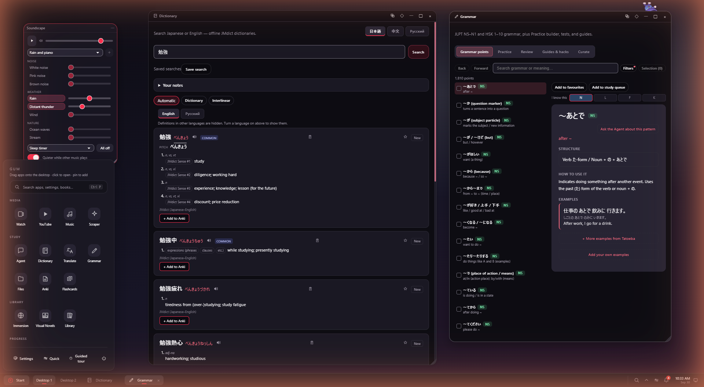
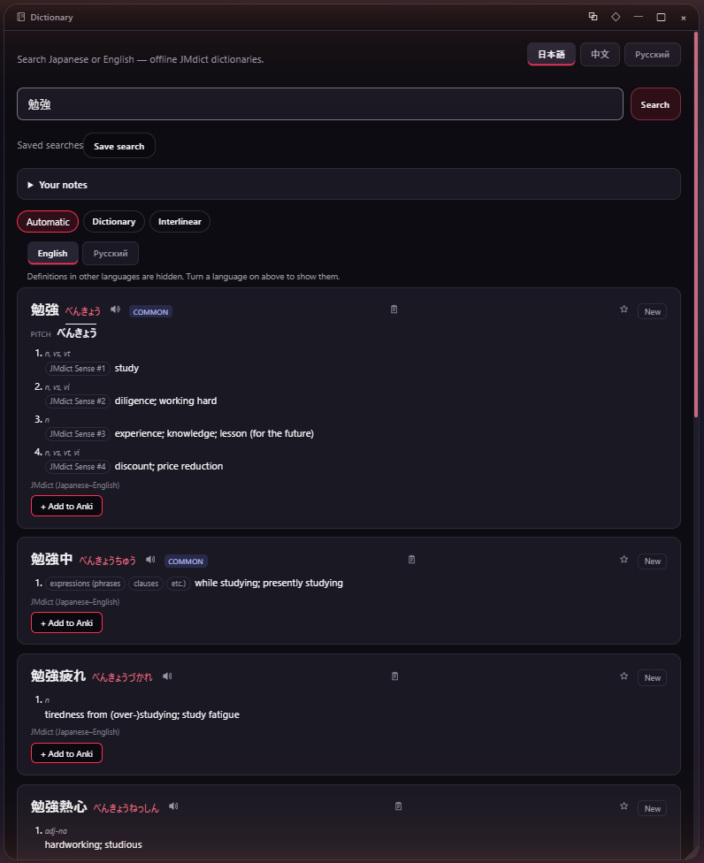
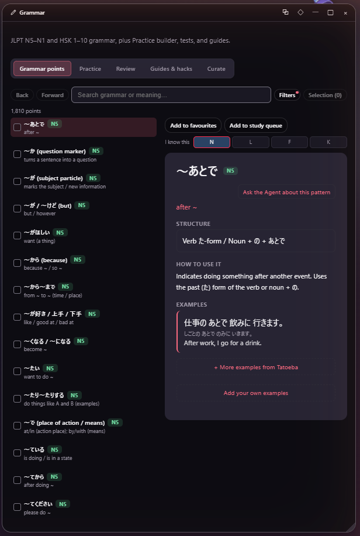
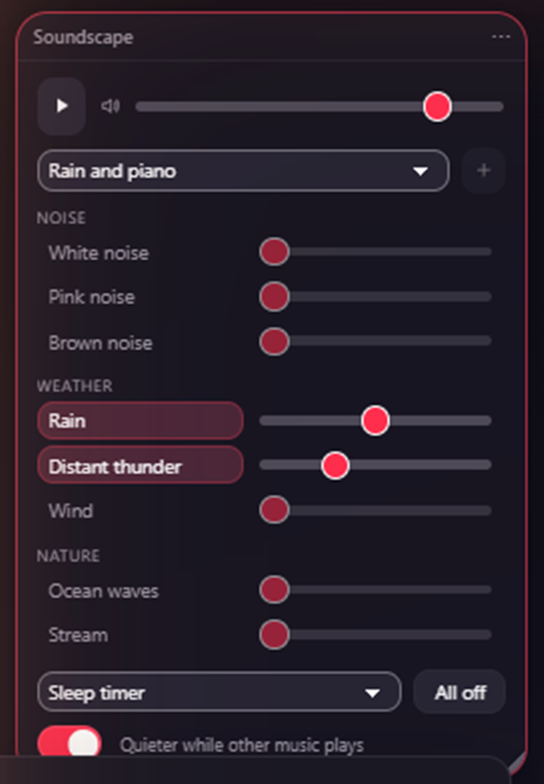

<h1 align="center">Gum</h1>

<p align="center">
  <b>A desktop you study Japanese inside.</b><br>
  Dictionary, grammar, reader, flashcards, video, games and stats as windows on one offline-first desktop.
</p>

<p align="center">
  <a href="https://github.com/vasars2024-hub/jp-study-app/releases/latest"></a>
  
  <a href="LICENSE"></a>
  
</p>



Gum is an Electron app that looks and behaves like a small operating system: a
wallpaper, a taskbar, a Start menu, draggable windows and desktop widgets. Every
study tool is an app on that desktop, and they share one store of what you know —
a word you look up in the reader shows up in your flashcards, your statistics and
your widgets without being copied anywhere.

It is built for Japanese first. The grammar explorer also covers Chinese (HSK),
and the interface is available in English, Japanese, Chinese and Russian.

## What is in it

| | |
|---|---|
| **Look things up** | Offline JMdict dictionary with pitch accent and audio, saved searches and your own notes. Sentence analysis and translation. A global overlay so a lookup never means leaving what you are reading. |
| **Grammar** | 1,810 grammar points across JLPT N5–N1 and HSK 1–10, each with structure, usage and examples, plus a practice builder, tests and guides. |
| **Read** | Novel reader with tap-to-look-up, highlights and annotations. Manga reader with OCR. A browser for reading real sites with the dictionary attached. |
| **Reading Lens** | A system-wide hotkey that OCRs any region of your screen — a game, a PDF, a video — and opens it as text you can look up and mine. |
| **Mine and review** | One-click mining to Anki through AnkiConnect, `.apkg` import, a field-mapping editor, and a built-in flashcard deck with its own scheduling for when you do not use Anki. |
| **Watch and listen** | Local video with study subtitles, sentence mining from a line, dictation practice, YouTube playlists and a music player with a visualizer. |
| **Play** | Fifteen small games built on your own vocabulary: kana sprint, cloze blitz, particle panic, listening flash and more. |
| **Track** | Statistics, streaks, a review forecast, a study calendar with reminders, and desktop widgets for all of it. |
| **Make it yours** | Themes, wallpapers and rotation playlists, a companion that reacts to your study, over a hundred rebindable keyboard commands and a command palette. |

<p align="center">
  
  
</p>

### What works, honestly

[`FEATURES.md`](FEATURES.md) lists every feature with the file it starts in and
one of four words: **driven** (someone ran it in the live app), **tested**,
**unverified** or **broken**. Nothing is called working on the strength of a
passing test. Measured defects that were left unfixed are in
[`docs/KNOWN_ISSUES.md`](docs/KNOWN_ISSUES.md), each with a command that
reproduces it. Read those two before relying on something.

## Install

Windows x64 builds are on the [releases page](https://github.com/vasars2024-hub/jp-study-app/releases).
The release is split in two because of GitHub's file size limit, and you need both:

1. **`…-core.zip`** is the app itself. Extract it to a folder of your choice.
2. **`…-public.zip`** holds the models, dictionaries and OCR assets. Extract it
   into `resourcespublic` inside that same folder.

```
jp-study-app-win32-x64  jp-study-app.exe
  resources    app    public    <- the public zip goes here
```

Then run `jp-study-app.exe`. There is no installer.

Further assets (more OCR and speech models) can be downloaded from inside the app
under **Settings → Storage**. Those downloads resume if interrupted.

Optional, for mining to Anki: [Anki](https://apps.ankiweb.net/) with the
[AnkiConnect](https://ankiweb.net/shared/info/2055492159) add-on.

## Build from source

You need Git and a recent [Node.js](https://nodejs.org/) (it is developed on Node 24), on Windows.

```bash
git clone https://github.com/vasars2024-hub/jp-study-app.git
cd jp-study-app
npm install
npm start
```

A source checkout does not include the runtime data (models, dictionaries, OCR
assets). Put the contents of the release's `public` zip into `public/` before the
first run, or the dictionary and OCR will have nothing to load.

| Command | What it does |
|---|---|
| `npm start` | Run the app in development mode with hot reload. |
| `npm test` | Run the test suite (Vitest). |
| `npm run lint` | Lint the TypeScript sources. |
| `npm run package:win` | Build a Windows package into `out/`. |
| `node tools/i18n-check.cjs` | List interface strings missing a translation. |

Development mode uses noticeably more memory than a packaged build. On a machine
with 8 GB of RAM, close other heavy apps first.

## Browser extension

[`extension/`](extension) is a Chrome companion for reading on the web: hold a key
and hover Japanese text for a lookup with grammar and sentence analysis, save
words and sentences to the app, make Anki cards, and OCR a region of a page.

It is loaded unpacked rather than from the Chrome Web Store: open
`chrome://extensions`, turn on **Developer mode**, choose **Load unpacked** and
pick the `extension` folder, then pair it with the app using the token under
**Settings → Study → Chrome extension**. The extension's own
[`README`](extension/README.md) covers the rest.

## How the code is laid out

```
src/main/        Electron main process: files, OCR, downloads, Anki, media
src/renderer/    The desktop shell and every app (React)
src/shared/      Code and types used by both, including all interface text
src/media/       The video study player
extension/       Browser extension
tools/           Build, packaging and checking scripts
docs/            Plans, audits and known issues
```

Interface text lives in `src/shared/i18n/catalogs/` with one file per language.
New text is added in English first and must be translated into the other three
before the test suite passes; [`CLAUDE.md`](CLAUDE.md) describes the workflow.

## Branches

- **`master`** is the public line and what releases are cut from.
- **`relay/astra`** collects small bug fixes and quality-of-life changes that are
  reviewed in batches before they land. It currently adds, among other things, a
  reading-time estimate in the novel reader, a rest day for study streaks, a leech
  filter for flashcards and a **Soundscape** widget: a mixer of generated rain,
  noise, nature and café sounds under generated lofi, jazz or piano, for studying
  to. The screenshots on this page were taken from that branch.

<p align="center">
  
</p>

## Contributing

Issues and pull requests are welcome. Two rules keep the codebase consistent:
keep changes inside `src/`, and put every new piece of interface text through the
translation catalogs. [`AGENTS.md`](AGENTS.md) has the short version of the house
style.

## Licence

[GPL-3.0-or-later](LICENSE). Dictionary data comes from
[JMdict](https://www.edrdg.org/jmdict/j_jmdict.html) (EDRDG), pitch accent from
[Kanjium](https://github.com/mifunetoshiro/kanjium) and example sentences from
[Tatoeba](https://tatoeba.org/); each keeps its own licence.
