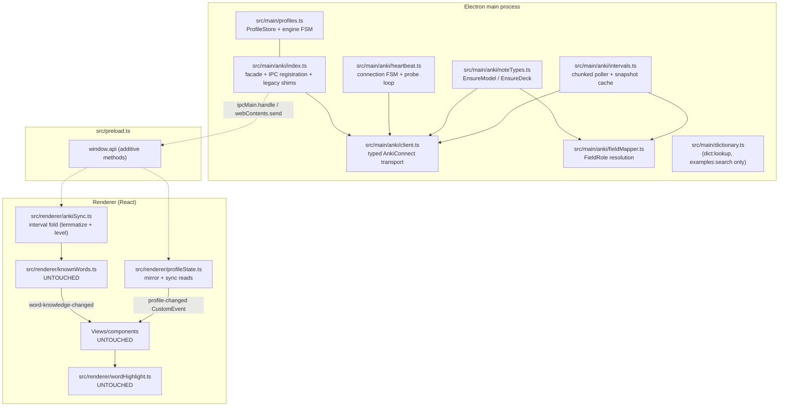
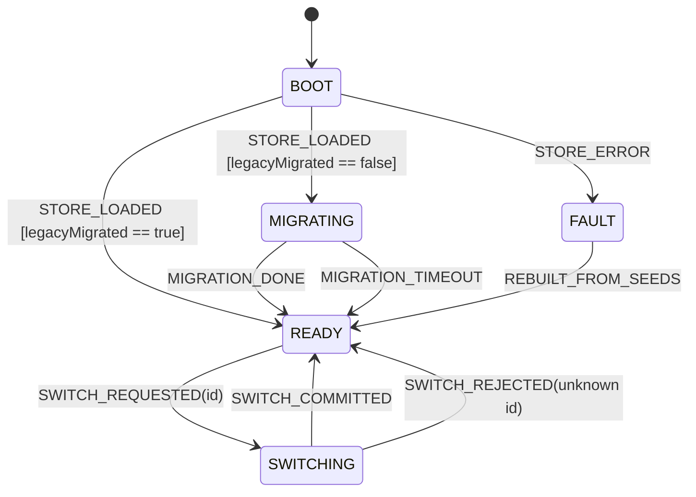
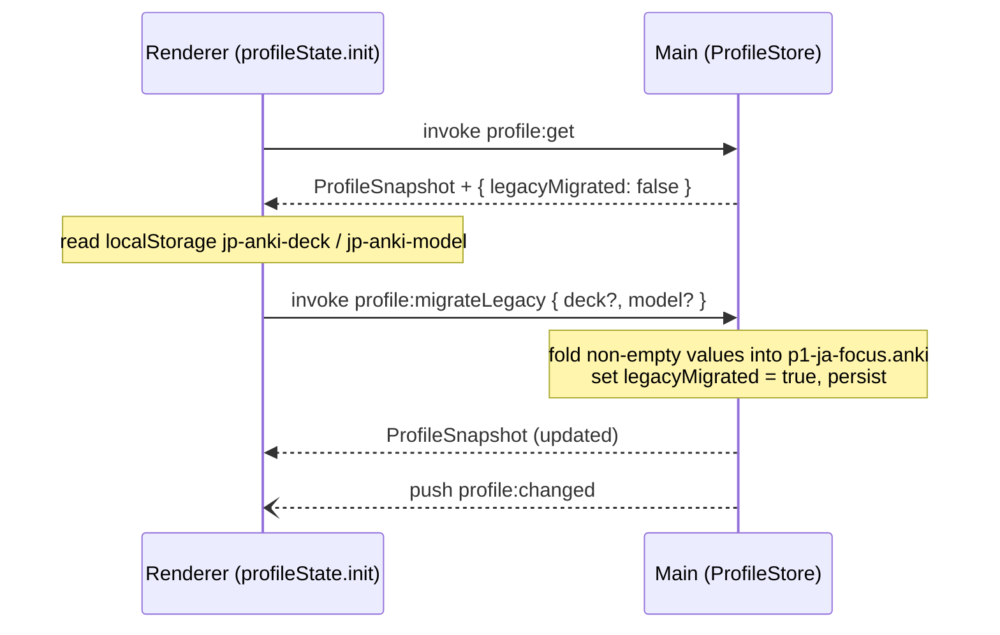
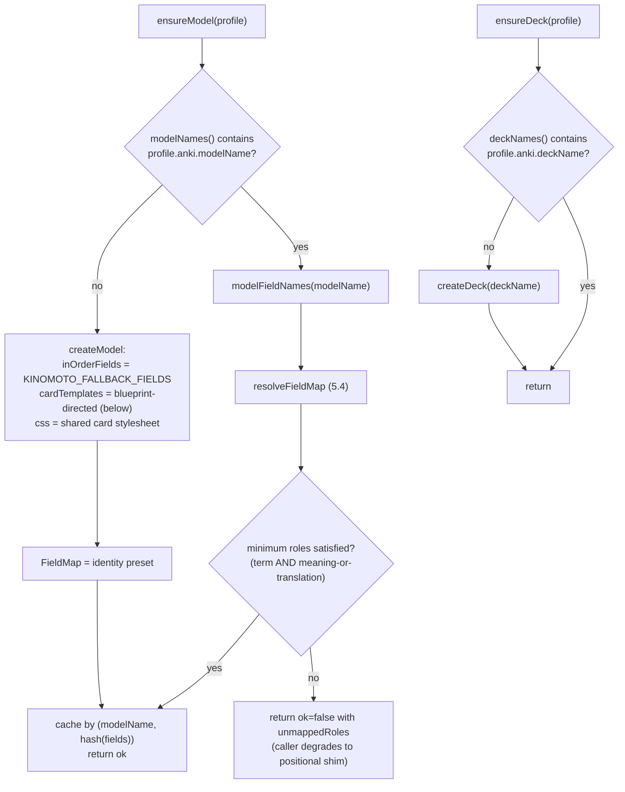
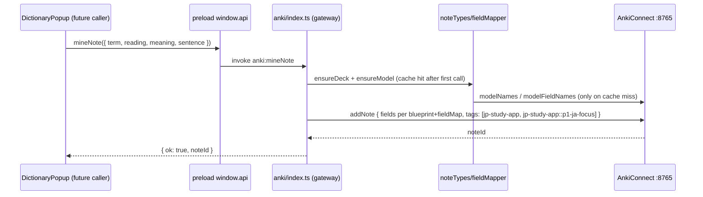
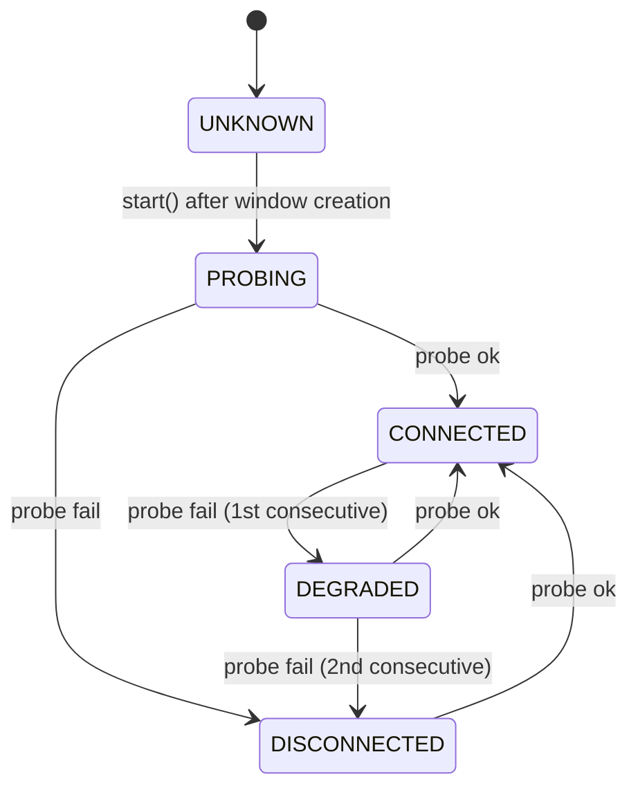
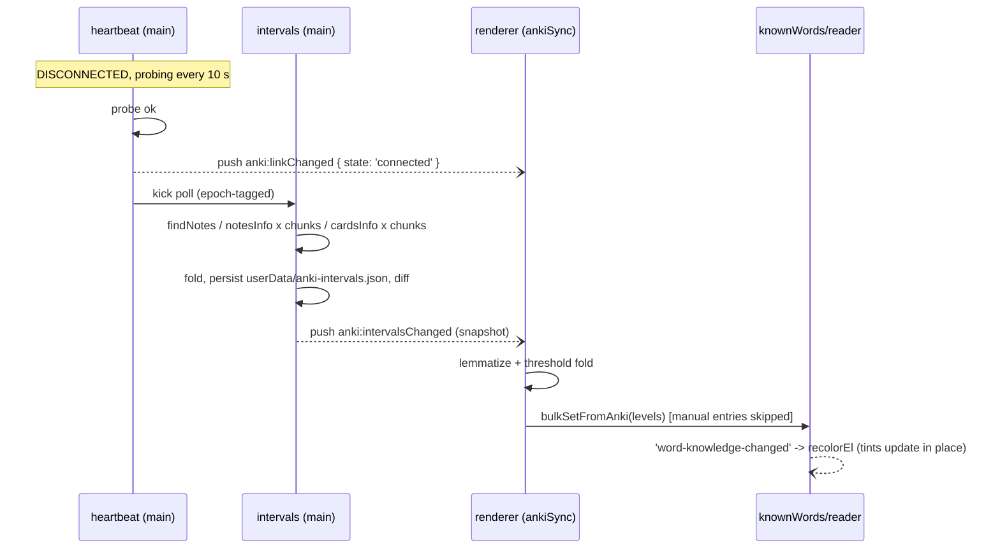

# SERVICES_PATCH.md — Data-Layer Refactor Specification

| | |
|---|---|
| **Document** | Backend architectural design specification: Multi-Language Profile State Engine + Advanced Anki Connector and Interval Recovery |
| **Version** | 1.0 (2026-07-06) |
| **Scope** | `src/` only — main-process services, preload bridge, renderer service modules. Zero changes to visual components, shell, or root configs. |
| **Fulfills** | TASKS.md Task 1 (Anki Modifier Engine & Multi-Language Profile Data Layout) and Task 2 (Dynamic Field-Mapping & Interval Reading Logic) |
| **Status** | Design only. No implementation code ships with this document. |

---

## 0. Executive summary (plain language)

Today the app talks to Anki through one small module with a fixed idea of what a flashcard looks like, and it re-scans the whole Anki collection by hand when asked. This patch replaces that with two cooperating engines that live **underneath** the existing windows:

1. A **Profile Engine** that knows three "study modes" (Japanese focus, English-to-Japanese reverse, Russian-to-Japanese) and can switch between them instantly. Each profile carries its own card layout, Anki deck settings, and dictionary pipeline.
2. An **Anki Link** that keeps a background heartbeat to the Anki desktop app, understands the `jidoujisho Kinomoto` note type (and any other note type, by inspecting its fields at runtime), and periodically reads card intervals out of Anki so the reader can tint words you already know.

Everything the UI currently does keeps working unchanged: the old IPC channels remain as thin shims over the new services, and the reader's highlight markup is frozen. The visual windows never need to know this refactor happened.

---

## 1. Table of contents

- [2. Current-state audit](#2-current-state-audit)
- [3. Target module topology](#3-target-module-topology)
- [4. Part 1 — Multi-Language Profile State Engine](#4-part-1--multi-language-profile-state-engine)
- [5. Part 2 — Anki Connector and Interval Recovery](#5-part-2--anki-connector-and-interval-recovery)
- [6. IPC channel registry](#6-ipc-channel-registry)
- [7. Backward-compatibility and UI-freeze contract](#7-backward-compatibility-and-ui-freeze-contract)
- [8. File-change manifest](#8-file-change-manifest)
- [9. Acceptance criteria matrix](#9-acceptance-criteria-matrix)
- [10. Deferred items](#10-deferred-items)

---

## 2. Current-state audit

Facts the design builds on, verified against the live tree on 2026-07-06.

| Concern | Where it lives today | Disposition |
|---|---|---|
| AnkiConnect transport (`POST http://127.0.0.1:8765`, API v6, 3 s timeout) | `src/main/dictionary.ts` `ankiInvoke()` | **Extract** into `src/main/anki/client.ts` |
| Connection check + deck/model listing | `dictionary.ts` `ankiStatus()` | **Replace** with heartbeat-backed shim |
| Note creation, positional field mapping (field[0]=front, field[1]=back, sentence regex) | `dictionary.ts` `buildFields()` / `ankiAddNote()` | **Generalize** into FieldRole mapper; positional logic preserved as final fallback |
| Full-collection interval scan (`findNotes 'deck:*'` then `notesInfo` then `cardsInfo`) | `dictionary.ts` `ankiKnownWords()` | **Replace** with chunked, cached, diffed poller in `src/main/anki/intervals.ts` |
| Canonical unreachable-Anki copy | `dictionary.ts` `friendlyAnkiError()` line 152 | **Canonize** as exported constant `ANKI_UNREACHABLE_MSG` (string is already byte-exact with the requirement) |
| Interval-to-level policy (`>=21` d known, `>=1` d familiar, else learning) | `src/renderer/ankiSync.ts` `levelForInterval()` | **Keep**; thresholds become per-profile `DeckParams.thresholds` with identical defaults |
| Lemma-keyed knowledge store, manual-flag protection, `word-knowledge-changed` CustomEvent | `src/renderer/knownWords.ts` (localStorage key `jp-word-knowledge`) | **Untouched** |
| Reader tinting DOM contract (`span.wk.wk-{0..3}[data-lemma]`, `data-wk` done-marker) | `src/renderer/wordHighlight.ts`, consumed by `NovelReader.tsx` | **Frozen** |
| Kuromoji lemmatization | `src/renderer/tokenizer.ts` | **Untouched** (lemmatization stays renderer-side) |
| UI deck/model persistence | localStorage `jp-anki-deck`, `jp-anki-model` (written by `AnkiView.tsx`, `DictionaryResults.tsx`) | **Grandfathered**; folded into Profile 1 by a one-time migration handshake |
| IPC naming convention | `domain:action` invokes, `domain:changed` pushes (`library:changed`, `media:changed`) | **Followed** by all new channels |
| Performance rule | CLAUDE.md: heavy datasets processed asynchronously in the main process | **Enforced** by chunked polling and snapshot persistence |

---

## 3. Target module topology



Ownership rules:

- The **main process owns all durable state** introduced by this patch: `userData/profiles.json` and `userData/anki-intervals.json`. Writes are atomic (write `*.tmp`, then rename).
- The **renderer owns nothing new durable**; it holds in-memory mirrors refreshed by push events, plus its pre-existing localStorage stores (unchanged).
- `src/main/dictionary.ts` loses its entire `----- AnkiConnect -----` section. The three legacy channels it used to register move to `src/main/anki/index.ts` as shims (section 7). `dict:lookup` and `examples:search` stay where they are.
- `src/main.ts` gains exactly two calls inside `app.whenReady()`: `registerProfileIpc()` and `registerAnkiIpc()` (which also starts the heartbeat after window creation).

---

## 4. Part 1 — Multi-Language Profile State Engine

### 4.1 Concepts

A **StudyProfile** is pure data: it binds together (a) a card blueprint (which semantic content goes on which face, in which language), (b) an Anki binding (deck, note type, field overrides, tags), (c) deck parameters (sync query, JLPT target, interval thresholds), and (d) a lookup pipeline selector. Switching profiles swaps a pointer; no service is torn down.

All three seed profiles study Japanese (`targetLang: 'ja'`): the word-knowledge lemma space is Japanese in every mode, which is why the knowledge store stays global (section 4.6, invariant P-5).

### 4.2 Shared type definitions — new file `src/shared/profiles.ts`

```ts
// Types shared verbatim by main and renderer. No Electron imports allowed here.

export type ProfileId = 'p1-ja-focus' | 'p2-en-ja' | 'p3-ru-ja';

export type LangCode = 'ja' | 'en' | 'ru';

/** Semantic content slots a card face can render. */
export type CardContent = 'term' | 'reading' | 'meaning' | 'translation' | 'sentence';

/**
 * Which content goes on which face, and in which language each face is
 * written. Direction (JP front vs EN front vs RU front) is data, not code.
 */
export interface CardBlueprint {
  front: CardContent[];
  back: CardContent[];
  frontLang: LangCode;
  backLang: LangCode;
}

/** Semantic roles a note-type field can play (section 5.4). */
export type FieldRole =
  | 'term'
  | 'reading'
  | 'meaning'
  | 'translation'
  | 'sentence'
  | 'notes'
  | 'image'
  | 'termAudio'
  | 'sentenceAudio'
  | 'frequency';

export interface AnkiBinding {
  deckName: string;
  /** Defaults to KINOMOTO_MODEL_NAME (section 5.3). */
  modelName: string;
  /**
   * Explicit role-to-fieldName overrides. Highest priority in field
   * resolution; wins over runtime discovery and synonym matching.
   */
  fieldMap?: Partial<Record<FieldRole, string>>;
  /** Extra tags appended after the mandatory APP_TAG + profile tag. */
  extraTags?: string[];
}

export interface DeckParams {
  /**
   * AnkiConnect search query whose card intervals feed the knowledge store.
   * The interval poller unions this across ALL profiles (section 5.5).
   */
  syncQuery: string;
  /** Stats/labelling target. P1 tracks N2 vocabulary. */
  jlptTarget?: 'N5' | 'N4' | 'N3' | 'N2' | 'N1';
  /** Informational scheduling parameter surfaced in stats. */
  newPerDay?: number;
  /**
   * Interval thresholds in days for level classification.
   * Defaults replicate src/renderer/ankiSync.ts levelForInterval():
   * ivl >= known  -> level 3 (Known)
   * ivl >= familiar -> level 2 (Familiar)
   * else -> level 1 (Learning)
   */
  thresholds: { familiar: number; known: number };
}

export interface LookupBinding {
  /**
   * 'jmdict-jisho'  — existing main-process Jisho pipeline (JMdict data),
   *                   src/main/dictionary.ts lookupWord().
   * 'cedict-local'  — existing renderer CC-CEDICT module (chineseDict.ts).
   * 'none'          — profile performs no dictionary lookups.
   */
  pipeline: 'jmdict-jisho' | 'cedict-local' | 'none';
}

export interface StudyProfile {
  id: ProfileId;
  label: string;
  /** Lemma space tracked by the knowledge store. 'ja' for all seeds. */
  targetLang: 'ja';
  card: CardBlueprint;
  anki: AnkiBinding;
  deckParams: DeckParams;
  lookup: LookupBinding;
}

/** Durable store shape — userData/profiles.json. */
export interface ProfileStoreSchema {
  schemaVersion: 1;
  activeProfileId: ProfileId;
  profiles: Record<ProfileId, StudyProfile>;
  /** One AnkiConnect endpoint shared by every profile. */
  ankiUrl: string; // default 'http://127.0.0.1:8765'
  /** True once legacy localStorage keys were folded into p1 (section 4.7). */
  legacyMigrated: boolean;
}

/** Read-only wire snapshot pushed to the renderer. */
export interface ProfileSnapshot {
  activeProfileId: ProfileId;
  profiles: StudyProfile[];
  ankiUrl: string;
}
```

### 4.3 Seed profile definitions

Shipped as a typed constant in `src/shared/profiles.ts`; written to `profiles.json` on first boot and used to backfill missing keys on schema upgrades.

```ts
export const SEED_PROFILES: Record<ProfileId, StudyProfile> = {
  'p1-ja-focus': {
    id: 'p1-ja-focus',
    label: 'Japanese Focus',
    targetLang: 'ja',
    card: {
      // Native Japanese front, English back.
      front: ['term'],
      back: ['reading', 'meaning', 'sentence'],
      frontLang: 'ja',
      backLang: 'en',
    },
    anki: {
      deckName: 'JP Study::N2 Vocab',
      modelName: 'jidoujisho Kinomoto',
    },
    deckParams: {
      syncQuery: 'deck:*',
      jlptTarget: 'N2',
      newPerDay: 20,
      thresholds: { familiar: 1, known: 21 },
    },
    lookup: { pipeline: 'jmdict-jisho' },
  },

  'p2-en-ja': {
    id: 'p2-en-ja',
    label: 'Reverse Learning Focus',
    targetLang: 'ja',
    card: {
      // English front, Japanese kanji back.
      front: ['meaning'],
      back: ['term', 'reading', 'sentence'],
      frontLang: 'en',
      backLang: 'ja',
    },
    anki: {
      deckName: 'JP Study::EN to JP',
      modelName: 'jidoujisho Kinomoto',
    },
    deckParams: {
      syncQuery: 'deck:"JP Study::EN to JP"',
      thresholds: { familiar: 1, known: 21 },
    },
    lookup: { pipeline: 'jmdict-jisho' },
  },

  'p3-ru-ja': {
    id: 'p3-ru-ja',
    label: 'Russian Focus',
    targetLang: 'ja',
    card: {
      // Russian front, Japanese back.
      front: ['translation'],
      back: ['term', 'reading', 'sentence'],
      frontLang: 'ru',
      backLang: 'ja',
    },
    anki: {
      deckName: 'JP Study::RU to JP',
      modelName: 'jidoujisho Kinomoto',
    },
    deckParams: {
      syncQuery: 'deck:"JP Study::RU to JP"',
      thresholds: { familiar: 1, known: 21 },
    },
    lookup: { pipeline: 'jmdict-jisho' },
  },
} as const;
```

Notes:

- P3's `translation` content (Russian) is supplied by the caller of the mining API (`MineNoteRequest.translation`, section 5.6). The in-app provider is the existing translator service or manual entry; selecting a Russian dictionary source is deferred (section 10).
- Deck names are defaults, editable through `profile:update`. Decks are created lazily on first mine, never at boot (invariant A-1, section 5.8).

### 4.4 Engine state machine

The engine lives in `src/main/profiles.ts` and is the single writer of `profiles.json`.



Transition table:

| # | From | Event | Guard | Actions | To |
|---|---|---|---|---|---|
| T1 | BOOT | STORE_LOADED | file parsed, `schemaVersion` known | backfill missing profiles/fields from `SEED_PROFILES` | MIGRATING if `legacyMigrated == false`, else READY |
| T2 | BOOT | STORE_ERROR | file missing, unparsable, or unknown future schema | log; rebuild store from `SEED_PROFILES` (missing file is the normal first boot); persist | FAULT then immediately READY via REBUILT_FROM_SEEDS |
| T3 | MIGRATING | MIGRATION_DONE | renderer completed the `profile:migrateLegacy` handshake (4.7) | fold legacy deck/model into `p1-ja-focus.anki`; set `legacyMigrated = true`; persist; push `profile:changed` | READY |
| T4 | MIGRATING | MIGRATION_TIMEOUT | 10 s without handshake (renderer had no legacy keys or crashed) | set `legacyMigrated = true`; persist | READY |
| T5 | READY | SWITCH_REQUESTED(id) | — | increment `profileEpoch` | SWITCHING |
| T6 | SWITCHING | SWITCH_COMMITTED | `id` exists in store | set `activeProfileId = id`; persist; push exactly one `profile:changed`; notify Anki layer (may recompute interval union, 5.5) | READY |
| T7 | SWITCHING | SWITCH_REJECTED | `id` not in store | return error to caller; no persist, no push | READY |
| T8 | READY | UPDATE_REQUESTED(id, patch) | patch passes validation (4.5) | merge; persist; push `profile:changed`; invalidate field-map cache for that profile's model (5.4) | READY |

While in MIGRATING, read channels (`profile:get`, `profile:list`) already answer from the loaded store; only the migration fold is pending. SWITCHING is instantaneous in practice (memory pointer + async persist) — the state exists to serialize concurrent switch requests: requests arriving mid-switch queue and apply last-wins.

### 4.5 Validation rules for `profile:update`

- `id`, `targetLang` are immutable; patches containing them are rejected.
- `card.front` and `card.back` must be non-empty and disjoint-per-face duplicates-free.
- `anki.deckName` and `anki.modelName` must be non-empty strings (existence in Anki is NOT validated here — the Anki link may be down; existence is resolved lazily by EnsureModel/EnsureDeck, 5.3).
- `deckParams.thresholds` must satisfy `0 < familiar <= known`.
- `deckParams.syncQuery` must be a non-empty string; it is passed verbatim to AnkiConnect `findNotes`.
- A rejected patch returns `{ ok: false, error }` and produces no state change and no push.

### 4.6 Engine invariants

| # | Invariant |
|---|---|
| P-1 | Exactly one `activeProfileId` at all times; every persist is atomic (temp file + rename), so a crash never leaves a torn store. |
| P-2 | Exactly one `profile:changed` push per committed mutation (switch or update). Subscribers can treat pushes as edges, not levels. |
| P-3 | The renderer mirror answers `getActiveProfile()` synchronously from cache; profile reads never appear on hot paths as IPC round-trips (highlighting, tokenization). |
| P-4 | Each switch increments a monotonically increasing `profileEpoch`. Long-running Anki work carries the epoch it started under and aborts when it no longer matches (5.5, 5.8). |
| P-5 | The word-knowledge store (`jp-word-knowledge`) is global to the Japanese lemma space. Profile switches MUST NOT clear, rewrite, or re-key it. Reader tinting is therefore switch-stable. Future non-`ja` targets get sibling namespaces `jp-word-knowledge::<lang>`; the bare legacy key is grandfathered as the `ja` namespace. |
| P-6 | The engine never touches localStorage; the renderer never touches `profiles.json`. All crossings go through the IPC registry (section 6). |

### 4.7 Legacy migration handshake

Renderer-owned legacy keys must reach the main-owned store exactly once.



- Idempotent: guarded by `legacyMigrated`; repeat invocations are no-ops returning the current snapshot.
- The user's existing choice wins over seed defaults: a non-empty legacy `jp-anki-deck` replaces `p1.anki.deckName`; same for model.
- Legacy views keep reading/writing their localStorage keys unchanged (section 7); the fold is one-way and one-time.

### 4.8 Renderer mirror — new file `src/renderer/profileState.ts`

Follows the house pattern of `knownWords.ts` (module-level cache + CustomEvent).

```ts
export const PROFILE_EVENT = 'profile-changed'; // window CustomEvent<ProfileSnapshot>

/** Boot: fetch snapshot, run the 4.7 handshake, subscribe to pushes. */
export function initProfileState(): Promise<void>;

/** Synchronous cached reads (safe before init resolves: falls back to seeds). */
export function getActiveProfile(): StudyProfile;
export function getProfiles(): StudyProfile[];

export function switchProfile(id: ProfileId): Promise<{ ok: boolean; error?: string }>;
export function updateProfile(
  id: ProfileId,
  patch: Partial<StudyProfile>,
): Promise<{ ok: boolean; error?: string }>;

/** Subscribe to mirror refreshes (returns unsubscribe). */
export function onProfileChanged(cb: (snap: ProfileSnapshot) => void): () => void;
```

`initProfileState()` is called once from `src/renderer/main.tsx` bootstrap. Until it resolves, `getActiveProfile()` returns `SEED_PROFILES['p1-ja-focus']` — identical to today's implicit behavior, so nothing downstream can observe a regression.

---

## 5. Part 2 — Anki Connector and Interval Recovery

### 5.1 Shared type definitions — new file `src/shared/anki.ts`

```ts
import type { FieldRole, ProfileId } from './profiles';

/** Byte-exact UI copy required on connection failure. Single source of truth. */
export const ANKI_UNREACHABLE_MSG =
  "Can't reach Anki. Open Anki desktop and make sure the AnkiConnect add-on is installed.";

export const APP_TAG = 'jp-study-app';
export const KINOMOTO_MODEL_NAME = 'jidoujisho Kinomoto';

// ----- Connection (heartbeat) ---------------------------------------------

export type AnkiLinkState = 'checking' | 'connected' | 'disconnected';

export interface AnkiLinkStatus {
  state: AnkiLinkState;
  /** Present iff state === 'disconnected'; always ANKI_UNREACHABLE_MSG for transport faults. */
  error?: string;
  /** AnkiConnect API version from the last successful probe. */
  apiVersion?: number;
  lastOkAt?: number;    // epoch ms
  lastProbeAt?: number; // epoch ms
  consecutiveFailures: number;
}

// ----- Mining (profile-aware note creation) --------------------------------

export interface MineNoteRequest {
  /** Defaults to the active profile. */
  profileId?: ProfileId;
  term: string;
  reading?: string;
  /** English gloss (P1 back, P2 front). */
  meaning?: string;
  /** Front-language translation for translation-front profiles (P3: Russian). */
  translation?: string;
  /** Mining context sentence (reader / subtitle line). */
  sentence?: string;
  extraTags?: string[];
}

export interface MineNoteResult {
  ok: boolean;
  noteId?: number;
  /** 'duplicate' | ANKI_UNREACHABLE_MSG | verbatim AnkiConnect API error. */
  error?: string;
}

// ----- Note-type integration ------------------------------------------------

export interface EnsureModelResult {
  ok: boolean;
  modelName: string;
  /** True when this call created the model inside the user's collection. */
  created: boolean;
  /** Resolved role map actually in force (after the 5.4 algorithm). */
  fieldMap: Partial<Record<FieldRole, string>>;
  /** Roles the blueprint needs that no field could satisfy. */
  unmappedRoles: FieldRole[];
  error?: string;
}

// ----- Interval reading -------------------------------------------------------

export interface IntervalEntry {
  /** Cleaned expression from the note's term field (HTML/furigana stripped). */
  expression: string;
  /** Longest interval across the note's cards, in days. */
  ivlDays: number;
  noteId: number;
  modelName: string;
}

export interface IntervalSnapshot {
  generatedAt: number;          // epoch ms
  sourceQueries: string[];      // deduped union of profile syncQueries
  entries: IntervalEntry[];
  noteCount: number;            // notes scanned before filtering
  truncated: boolean;           // true if the 100k safety cap was hit
}

/** Binary rollup consumed by reader-facing features ("known" vs "new"). */
export type KnownCategory = 'known' | 'new';
// Rollup rule: WkLevel >= 3  -> 'known'; WkLevel 0..2 -> 'new'.
// WkLevel derivation from ivlDays uses the profile thresholds (4.2 DeckParams):
//   ivlDays >= thresholds.known    -> 3
//   ivlDays >= thresholds.familiar -> 2
//   else                           -> 1
```

### 5.2 Transport — `src/main/anki/client.ts`

A typed wrapper over the existing fetch pattern. One request shape: `POST <ankiUrl>` with body `{ action, version: 6, params }`.

```ts
/** Compile-time action map: params and result types per AnkiConnect action. */
interface AnkiActionMap {
  version:         { params: undefined;                       result: number };
  deckNames:       { params: undefined;                       result: string[] };
  createDeck:      { params: { deck: string };                result: number };
  modelNames:      { params: undefined;                       result: string[] };
  modelFieldNames: { params: { modelName: string };           result: string[] };
  createModel:     { params: CreateModelParams;               result: unknown };
  addNote:         { params: { note: AnkiNoteInput };         result: number };
  canAddNotes:     { params: { notes: AnkiNoteInput[] };      result: boolean[] };
  findNotes:       { params: { query: string };               result: number[] };
  notesInfo:       { params: { notes: number[] };             result: AnkiNoteInfo[] };
  cardsInfo:       { params: { cards: number[] };             result: AnkiCardInfo[] };
}

interface AnkiNoteInput {
  deckName: string;
  modelName: string;
  fields: Record<string, string>;
  tags: string[];
  options: { allowDuplicate: false };
}

interface AnkiNoteInfo {
  noteId: number;
  modelName: string;
  fields: Record<string, { value: string; order: number }>;
  cards: number[];
  tags: string[];
}

interface AnkiCardInfo {
  cardId: number;
  interval: number; // days; negative values (learning steps in seconds) clamp to 0
  note: number;
}

interface CreateModelParams {
  modelName: string;
  inOrderFields: string[];
  css: string;
  cardTemplates: { Name: string; Front: string; Back: string }[];
}

declare function invoke<A extends keyof AnkiActionMap>(
  action: A,
  params: AnkiActionMap[A]['params'],
  opts?: { timeoutMs?: number; signal?: AbortSignal },
): Promise<AnkiActionMap[A]['result']>;
```

Timeout tiers (defaults; per-call override via `opts`):

| Tier | Actions | Timeout |
|---|---|---|
| FAST | `version`, `deckNames`, `modelNames`, `modelFieldNames` | 3 000 ms (matches today) |
| MUTATE | `addNote`, `canAddNotes`, `createModel`, `createDeck` | 8 000 ms |
| BULK | `findNotes`, `notesInfo`, `cardsInfo` | 20 000 ms per chunk |

Error taxonomy — every failure is normalized before leaving the client:

```ts
export type AnkiErrorKind =
  | 'transport'  // fetch failed / ECONNREFUSED / abort-by-timeout: Anki or add-on absent
  | 'timeout'    // AbortSignal fired (folded into transport for UI purposes)
  | 'api'        // HTTP 200 but body.error set (bad deck, bad model, collection locked)
  | 'duplicate'; // api error matching /duplicate/i, split out for callers

export class AnkiError extends Error {
  kind: AnkiErrorKind;
  action: keyof AnkiActionMap;
}
```

Mapping rule at every IPC boundary: `transport | timeout` becomes `ANKI_UNREACHABLE_MSG` (and feeds the heartbeat failure counter); `api` surfaces its verbatim message; `duplicate` surfaces the literal string `'duplicate'` (preserving the contract `AnkiView.tsx` and `DictionaryResults.tsx` already match on).

### 5.3 Note-type integration — `src/main/anki/noteTypes.ts`

Target note type: **`jidoujisho Kinomoto`**.

Authority rule (load-bearing): **runtime discovery is authoritative**. When a model with the bound name already exists in the user's collection — e.g. created by jidoujisho itself — its actual `modelFieldNames` result defines the fields, and roles are resolved against it (5.4). The static field list below is an **app-defined, role-complete superset used only when this app must create the model fresh**; it is not a claim about jidoujisho's internal field order (public documentation of the Kinomoto layout is outdated, which is precisely why discovery-first is the only robust design).

```ts
export const KINOMOTO_FALLBACK_FIELDS: readonly string[] = [
  'Term',            // role: term
  'Reading',         // role: reading
  'Meaning',         // role: meaning
  'Translation',     // role: translation
  'Sentence',        // role: sentence
  'Notes',           // role: notes
  'Image',           // role: image
  'Term Audio',      // role: termAudio
  'Sentence Audio',  // role: sentenceAudio
  'Frequency',       // role: frequency
];
```

EnsureModel flow (runs lazily — see invariant A-1):



Card templates generated on `createModel` are **direction-correct per profile**, derived mechanically from `CardBlueprint`: every `CardContent` slot in `blueprint.front` emits a `{{FieldName}}` mustache (via the role map) into the Front template with `lang="<frontLang>"` markup; `blueprint.back` does the same after `{{FrontSide}}<hr id="answer">`. Empty-field conditionals use standard Anki `{{#Field}}...{{/Field}}` sections. Template payload skeleton (data, not app code):

```html
<!-- Front (P1 'Recognition': term only, lang=ja) -->
<div class="jsa-face" lang="ja">{{Term}}</div>

<!-- Back (P1: reading, meaning, sentence) -->
{{FrontSide}}
<hr id="answer">
{{#Reading}}<div class="jsa-reading" lang="ja">{{Reading}}</div>{{/Reading}}
{{#Meaning}}<div class="jsa-meaning" lang="en">{{Meaning}}</div>{{/Meaning}}
{{#Sentence}}<div class="jsa-sentence" lang="ja">{{Sentence}}</div>{{/Sentence}}
```

For P2 the Front slot is `{{Meaning}}` (`lang="en"`) and the Back leads with `{{Term}}` (kanji, `lang="ja"`); for P3 the Front slot is `{{Translation}}` (`lang="ru"`).

Direction on **foreign models** (e.g. stock `Basic`, resolved positionally): direction is achieved by content placement, not templates — for P2/P3 the blueprint's front content list lands in field[0] and the back content in field[1]. This exactly generalizes today's `buildFields()`.

Tagging policy (mandatory, applied by the gateway, never by callers):

```
tags = [APP_TAG, `${APP_TAG}::${profileId}`, ...profile.anki.extraTags ?? [], ...request.extraTags ?? []]
     =  ['jp-study-app', 'jp-study-app::p1-ja-focus', ...]
```

### 5.4 Dynamic field mapping — `src/main/anki/fieldMapper.ts`

Resolution algorithm, first match wins per role, evaluated in priority order:

```
resolveFieldMap(profile, modelName, discoveredFields: string[]):
  1. profile.anki.fieldMap overrides        (user/config supplied; verbatim field names,
                                             dropped with a log line if absent from discoveredFields)
  2. exact-name preset identity             (iff modelName === KINOMOTO_MODEL_NAME and the
                                             discovered field exists under its preset name)
  3. synonym scan                           (ROLE_SYNONYMS regex table below, case-insensitive,
                                             first unclaimed discovered field wins; a field can
                                             satisfy at most one role)
  4. positional fallback                    (only for roles term and meaning:
                                             field[0] -> term, field[1] -> meaning
                                             — byte-compatible with today's buildFields())
```

```ts
export const ROLE_SYNONYMS: Record<FieldRole, RegExp> = {
  term:          /^(term|expression|word|front|単語|表現)$/i,
  reading:       /^(reading|furigana|kana|yomi|よみ|読み|ルビ)$/i,
  meaning:       /^(meaning|definition|glossary|gloss|back|意味|定義)$/i,
  translation:   /(translation|訳|翻訳)/i,
  sentence:      /(sentence|context|例文|用例|^文$)/i,   // superset of dictionary.ts:188
  notes:         /^(notes?|備考|メモ)$/i,
  image:         /^(image|picture|screenshot|画像)$/i,
  termAudio:     /^((term|word)[ _-]?audio|audio|音声)$/i,
  sentenceAudio: /(sentence[ _-]?audio)/i,
  frequency:     /(freq|頻度)/i,
};
```

Cache: resolved maps are memoized under key `(modelName, fnv1a(discoveredFields.join('\x1f')))`. Invalidation: on `profile:update` touching `anki.*` (T8), on heartbeat reconnect (model may have been edited while Anki was closed), and on any `api`-kind error mentioning fields.

Sentence-overflow rule (compatibility): when a `sentence` value exists but no field resolved for the role, the sentence is appended to the meaning content as `<br><br><i>{sentence}</i>` — today's behavior, preserved verbatim.

### 5.5 Interval reading pipeline — `src/main/anki/intervals.ts`

Purpose: extract per-expression mastery intervals from Anki, categorize vocabulary as known/new, and feed the reader's tinting layer — without ever blocking the UI or requiring Anki to be open at boot.

Data flow (ownership per stage):

```
MAIN  1. queries   = dedupe(union of every profile.deckParams.syncQuery)
MAIN  2. noteIds   = union over queries of findNotes(query)          [BULK tier]
MAIN  3. notes     = notesInfo(noteIds) in chunks of 500             [sequential chunks]
MAIN  4. term extraction per note:
           field = FieldMap(model).term  if resolvable for that note's model
                   else fields[order==0]                (today's rule)
           expression = cleanAnkiField(value)           (strip HTML tags, [furigana], entities)
           skip if expression == '' or length > 24 or /\s/          (today's rule)
MAIN  5. cardIds   = union of note.cards; cards = cardsInfo(cardIds) in chunks of 500
MAIN  6. fold: entries[expression] = max(interval across the note's cards, 0)
MAIN  7. snapshot  = IntervalSnapshot; persist atomically to userData/anki-intervals.json
MAIN  8. diff vs previous snapshot; if any expression's ivl changed:
           push anki:intervalsChanged (full snapshot payload)
REND  9. ankiSync fold (existing module, upgraded internally, public API unchanged):
           lemma = kuromoji content-token lemma of expression        (tokenizer.ts, renderer-side)
           level = thresholds fold (ivl >= known -> 3, >= familiar -> 2, else 1)
           keep max level on lemma collisions
REND 10. bulkSetFromAnki(levels)   — manual-flag entries untouched   (knownWords.ts, unchanged)
REND 11. 'word-knowledge-changed'  — NovelReader recolorEl           (unchanged chain)
```

Scheduling and concurrency:

| Trigger | Behavior |
|---|---|
| Heartbeat transition to CONNECTED | immediate poll |
| Periodic while CONNECTED | every 5 min |
| `anki:getIntervals { maxAgeMs }` invoke with stale cache | on-demand poll (StatisticsView "Sync" button path) |
| Profile switch or update that changes the query union | poll iff the deduped union actually changed |
| Concurrency | single-flight; a new trigger while polling coalesces into the running poll unless the epoch changed |
| Cancellation | every poll carries `(profileEpoch, AbortController)`; epoch mismatch (P-4) aborts between chunks and discards partial results |
| Safety cap | 100 000 entries, then `truncated: true` (bounds memory on pathological collections) |
| Offline boot | persisted snapshot is loaded and served to the renderer before any probe succeeds; tints are correct with Anki closed |

Known/new categorization contract (reader-facing): the renderer keeps full 4-level fidelity (`wk-0..wk-3` CSS classes, unchanged DOM), and any consumer needing the binary form uses the `KnownCategory` rollup — `WkLevel >= 3` is `'known'`, everything else `'new'` (5.1). The tint list "fed directly to the text-reader window" is therefore exactly today's chain: `knownWords.getLevel(lemma)` at wrap time plus `recolorEl` on change events; this patch upgrades what feeds it, never how it renders.

### 5.6 Mining gateway (profile-aware note creation)

`anki:mineNote` composes and submits a note under the active (or explicit) profile:

```
mineNote(req):
  profile   = store.get(req.profileId ?? store.activeProfileId)
  ensureDeck(profile); ensureModel(profile)          // lazy, cached, invariant A-1
  content   = { term, reading, meaning, translation, sentence } from req
  fields    = {}
  for role in blueprint.front ++ blueprint.back:     // deduped, order-preserving
      fieldName = fieldMap[role]; if fieldName: fields[fieldName] = escapeForAnki(content[role])
  apply sentence-overflow rule (5.4) if needed
  addNote { deckName, modelName, fields, tags (5.3), options: { allowDuplicate: false } }
  on AnkiError: duplicate -> { ok:false, error:'duplicate' }
               transport  -> { ok:false, error: ANKI_UNREACHABLE_MSG } + heartbeat.notifyFailure()
               api        -> { ok:false, error: message }
```

Sequence — mining from the reader popup while P1 is active:



### 5.7 Heartbeat — `src/main/anki/heartbeat.ts`

A background probe loop owning the connection state machine. Probe = `version` action at FAST timeout. Internal state DEGRADED implements the anti-flicker debounce; the wire/UI type only ever sees `checking | connected | disconnected`.



| # | From | Event | Actions | To | Wire push |
|---|---|---|---|---|---|
| H1 | UNKNOWN | `start()` | immediate first probe | PROBING | `anki:linkChanged { state: 'checking' }` |
| H2 | PROBING | probe ok | record `apiVersion`, `lastOkAt`; schedule next in 30 s; kick interval poll (5.5) | CONNECTED | `{ state: 'connected' }` |
| H3 | PROBING | probe fail | schedule next in 10 s | DISCONNECTED | `{ state: 'disconnected', error: ANKI_UNREACHABLE_MSG }` |
| H4 | CONNECTED | probe fail | `consecutiveFailures = 1`; fast retry in 5 s; **no push** (debounce) | DEGRADED | — |
| H5 | DEGRADED | probe ok | reset counter; next in 30 s; **no push** (state never visibly changed) | CONNECTED | — |
| H6 | DEGRADED | probe fail | `consecutiveFailures = 2`; next in 10 s | DISCONNECTED | `{ state: 'disconnected', error: ANKI_UNREACHABLE_MSG }` |
| H7 | DISCONNECTED | probe ok | reset counter; next in 30 s; invalidate field-map caches (5.4); kick interval poll | CONNECTED | `{ state: 'connected' }` |
| H8 | any | out-of-band transport failure from any client call | counts as a failed probe for the current state (fast-paths H4/H6) | per row above | per row above |
| H9 | any | `app` `before-quit` | clear timer | (halt) | — |

Cadence summary: 30 s while connected, 5 s single fast retry when degraded, 10 s while disconnected. Every state-bearing push carries the full `AnkiLinkStatus`; on failure the `error` field is byte-exactly:

```
Can't reach Anki. Open Anki desktop and make sure the AnkiConnect add-on is installed.
```

which is the same string `AnkiSetup.tsx` already renders from `status.error` — the component keeps working with zero edits.

Recovery sequence — Anki opened mid-session:



### 5.8 Connector invariants

| # | Invariant |
|---|---|
| A-1 | Passive operations (boot, heartbeat probes, interval polls) are strictly read-only against the user's collection. The connector mutates Anki (createDeck/createModel/addNote) only inside an explicit mine or ensure call. |
| A-2 | Every transport-kind failure surfaced to any UI path is the byte-exact `ANKI_UNREACHABLE_MSG` constant. No other wording may reach the renderer for reachability faults. |
| A-3 | The `'duplicate'` error literal is preserved verbatim (existing views branch on it). |
| A-4 | All bulk reads are chunked (500 ids/call) and sequential; the interval poller never blocks the main thread on a single mega-call (CLAUDE.md performance rule). |
| A-5 | The interval snapshot on disk is always a complete, atomically written document; the renderer can trust it at any boot without Anki running. |
| A-6 | Field mapping degrades in the exact order 5.4 defines, terminating in today's positional behavior — a note can always be produced for any 2-field-plus model. |
| A-7 | All long-running work is epoch-guarded (P-4): a profile switch can never interleave two profiles' results. |

---

## 6. IPC channel registry

Complete surface after the patch. "Shim" = legacy channel preserved byte-compatible, now delegating to the new services.

| Channel | Kind | Direction | Request payload | Response/push payload | Status |
|---|---|---|---|---|---|
| `profile:get` | invoke | R to M | — | `ProfileSnapshot & { legacyMigrated: boolean }` | new |
| `profile:list` | invoke | R to M | — | `StudyProfile[]` | new |
| `profile:switch` | invoke | R to M | `ProfileId` | `{ ok: boolean; error?: string; snapshot: ProfileSnapshot }` | new |
| `profile:update` | invoke | R to M | `{ id: ProfileId; patch: Partial<StudyProfile> }` | `{ ok: boolean; error?: string; snapshot: ProfileSnapshot }` | new |
| `profile:migrateLegacy` | invoke | R to M | `{ deck?: string; model?: string }` | `ProfileSnapshot` | new (one-shot) |
| `profile:changed` | push | M to R | — | `ProfileSnapshot` | new |
| `anki:linkState` | invoke | R to M | — | `AnkiLinkStatus` | new |
| `anki:linkChanged` | push | M to R | — | `AnkiLinkStatus` | new |
| `anki:mineNote` | invoke | R to M | `MineNoteRequest` | `MineNoteResult` | new |
| `anki:ensureModel` | invoke | R to M | `ProfileId?` | `EnsureModelResult` | new |
| `anki:getIntervals` | invoke | R to M | `{ maxAgeMs?: number }` | `IntervalSnapshot` | new |
| `anki:intervalsChanged` | push | M to R | — | `IntervalSnapshot` | new |
| `anki:status` | invoke | R to M | — | `AnkiStatus` (unchanged shape) | **shim** — `connected` from heartbeat cache; decks/models via FAST calls |
| `anki:addNote` | invoke | R to M | `AnkiAddRequest` (unchanged) | `AnkiAddResult` (unchanged) | **shim** — positional blueprint reproducing `buildFields()` semantics exactly |
| `anki:knownWords` | invoke | R to M | — | `{ ok, error?, words?: Record<string, number> }` (unchanged) | **shim** — projected from the latest `IntervalSnapshot` (refresh if older than 5 min) |
| `dict:lookup` | invoke | R to M | `string` | `DictResult` | unchanged |
| `examples:search` | invoke | R to M | `string` | `ExampleResult` | unchanged |
| `library:*`, `media:*`, `desktop:*`, `config:*`, `manga:*`, `net:*`, `shell:openExternal` | — | — | — | — | untouched |

Preload additions (`window.api`, purely additive; existing members unchanged):

```ts
profileGet(): Promise<ProfileSnapshot & { legacyMigrated: boolean }>;
profileList(): Promise<StudyProfile[]>;
profileSwitch(id: ProfileId): Promise<{ ok: boolean; error?: string; snapshot: ProfileSnapshot }>;
profileUpdate(id: ProfileId, patch: Partial<StudyProfile>):
  Promise<{ ok: boolean; error?: string; snapshot: ProfileSnapshot }>;
profileMigrateLegacy(v: { deck?: string; model?: string }): Promise<ProfileSnapshot>;
onProfileChanged(cb: (snap: ProfileSnapshot) => void): () => void;

ankiLinkState(): Promise<AnkiLinkStatus>;
onAnkiLinkChanged(cb: (s: AnkiLinkStatus) => void): () => void;
ankiMineNote(req: MineNoteRequest): Promise<MineNoteResult>;
ankiEnsureModel(id?: ProfileId): Promise<EnsureModelResult>;
ankiGetIntervals(opts?: { maxAgeMs?: number }): Promise<IntervalSnapshot>;
onAnkiIntervalsChanged(cb: (s: IntervalSnapshot) => void): () => void;
```

Push delivery: a `broadcast(channel, payload)` helper in `src/main/anki/index.ts` iterates `BrowserWindow.getAllWindows()` and calls `webContents.send` — correct for the single-window shell today and for macOS `activate` re-creation.

---

## 7. Backward-compatibility and UI-freeze contract

The enforceable guarantee that the working visual shell survives this patch untouched.

| Frozen contract | Exact terms |
|---|---|
| Legacy IPC | `anki:status`, `anki:addNote`, `anki:knownWords` keep their names, request shapes, and response shapes byte-for-byte (section 6 shims). `AnkiView.tsx` and `DictionaryResults.tsx` run unmodified. |
| Error copy | `AnkiSetup.tsx` renders `status.error`; the shims and heartbeat only ever emit `ANKI_UNREACHABLE_MSG` for reachability faults, so the setup card's text is stable. |
| Reader DOM | `span.wk.wk-{0..3}` classes, `data-lemma` attribute, `data-wk` done-marker: frozen. `wordHighlight.ts` is not edited. |
| Knowledge semantics | `jp-word-knowledge` localStorage key, `WkLevel 0..3`, manual-flag protection, `word-knowledge-changed` CustomEvent: frozen. `knownWords.ts` is not edited. |
| Renderer sync API | `syncKnowledgeFromAnki(): Promise<SyncResult>` keeps its signature and result shape (StatisticsView's button works unmodified); internally it now calls `ankiGetIntervals({ maxAgeMs: 0 })` and runs the same lemma+threshold fold. |
| Legacy localStorage | `jp-anki-deck` / `jp-anki-model` keep being read/written by the legacy views. The migration fold (4.7) reads them once; it never deletes or rewrites them. |
| Shell safety | No file under `src/renderer/components/` or `src/renderer/views/` is modified. Desktop grid, dragging layer, taskbar, and all window chrome are untouched (CLAUDE.md safety rule). |
| Root configs | `forge.config.ts`, `vite.*.config.ts`, `tsconfig.json`, `package.json`: untouched (CLAUDE.md scope rule). No new dependencies are required by this design. |

Degradation ladder (worst-case behavior is always defined):

1. Anki closed at boot: persisted `IntervalSnapshot` still tints the reader; heartbeat reports `disconnected` with the canonical message; mining returns the canonical message.
2. Model exists but fields are exotic: synonym scan, then positional fallback (A-6) — cards still get created, `EnsureModelResult.unmappedRoles` reports what could not be placed.
3. Store file corrupted: engine FAULT path rebuilds from seeds (T2); the app never refuses to start over profile data.

---

## 8. File-change manifest

| Path | Change |
|---|---|
| `src/shared/profiles.ts` | **new** — section 4.2/4.3 types + seeds |
| `src/shared/anki.ts` | **new** — section 5.1 types + `ANKI_UNREACHABLE_MSG`, `APP_TAG`, `KINOMOTO_MODEL_NAME` |
| `src/main/profiles.ts` | **new** — ProfileStore, engine FSM, `registerProfileIpc()` |
| `src/main/anki/client.ts` | **new** — typed transport, timeout tiers, `AnkiError` |
| `src/main/anki/heartbeat.ts` | **new** — connection FSM + probe loop |
| `src/main/anki/noteTypes.ts` | **new** — EnsureModel/EnsureDeck, Kinomoto fallback fields, template generation |
| `src/main/anki/fieldMapper.ts` | **new** — `ROLE_SYNONYMS`, resolution algorithm, cache |
| `src/main/anki/intervals.ts` | **new** — chunked poller, snapshot persistence, diffing |
| `src/main/anki/index.ts` | **new** — facade, `registerAnkiIpc()`, legacy shims, `broadcast()` |
| `src/renderer/profileState.ts` | **new** — renderer mirror (4.8) |
| `src/main.ts` | **modified (2 lines)** — register the two new IPC groups in `app.whenReady()` |
| `src/preload.ts` | **modified (additive)** — section 6 api methods |
| `src/renderer/window.d.ts` | **modified (additive)** — typings for the new api methods |
| `src/main/dictionary.ts` | **modified (subtractive)** — AnkiConnect section removed; `dict:lookup`/`examples:search` remain |
| `src/renderer/ankiSync.ts` | **modified (internal)** — consumes `anki:getIntervals`/push; public API frozen |
| `src/renderer/main.tsx` | **modified (1 line)** — `initProfileState()` in bootstrap |
| Everything else (all views, components, `knownWords.ts`, `wordHighlight.ts`, `tokenizer.ts`, `styles.css`, root configs) | **untouched — guaranteed** |

---

## 9. Acceptance criteria matrix

| # | Scenario | Expected behavior | Verifying signal |
|---|---|---|---|
| AC-1 | Boot with Anki closed | App starts normally; reader tints from persisted snapshot; link state `disconnected` | `anki:linkChanged { state: 'disconnected', error: ANKI_UNREACHABLE_MSG }` within 3 s of window load; `wk-*` spans present offline |
| AC-2 | Anki quits mid-session | At most one silent DEGRADED retry, then disconnected with canonical copy; no crash, no unhandled rejection | exactly one `anki:linkChanged` push (H6) within 35 s + 5 s retry window |
| AC-3 | Anki reopened later | Auto-reconnect within one 10 s probe; interval poll fires; tints update without reader interaction | H7 push, then `anki:intervalsChanged`, then `word-knowledge-changed` |
| AC-4 | Mine duplicate note | `{ ok: false, error: 'duplicate' }`; existing views show their current duplicate message | literal `'duplicate'` preserved end-to-end |
| AC-5 | Bound model missing from collection | First mine creates model with blueprint-correct templates + deck if needed, then adds the note | `EnsureModelResult.created === true`; note visible in Anki with both tags |
| AC-6 | User's own Kinomoto model with unknown field order | Discovery + synonym scan resolve roles; no createModel call issued | `EnsureModelResult.created === false`, `unmappedRoles` empty for blueprint roles |
| AC-7 | 50k-note collection | Poll completes in chunked calls; window dragging stays smooth during the poll (main-process fetches only) | no renderer jank; chunk count = ceil(n/500); snapshot persisted |
| AC-8 | Rapid profile switching (spam) | Last switch wins; exactly one `profile:changed` per commit; any in-flight poll for a stale epoch is aborted | P-2 and P-4 observed; no interleaved snapshots |
| AC-9 | Manual word grades | Entries with the manual flag never change from any interval sync | `bulkSetFromAnki` skip path (unchanged code) |
| AC-10 | Legacy UI regression sweep | AnkiView add-card, DictionaryResults mining, AnkiSetup retry, StatisticsView sync all work with zero component edits | `git diff --stat` shows no changes under `src/renderer/views/` or `src/renderer/components/` |
| AC-11 | Corrupted `profiles.json` | Engine rebuilds from seeds and reaches READY; a log line records the fault | T2 path; app usable on next frame |
| AC-12 | Profile switch stability of tints | Switching P1 to P3 and back changes no `wk-*` class in an open reader | P-5: knowledge store untouched by switches |

---

## 10. Deferred items (explicitly out of scope for this patch)

| Item | Reason deferred | Owning future task |
|---|---|---|
| Profile editor UI (switcher widget, deck/model pickers per profile) | This patch is data-layer only; legacy views keep functioning meanwhile | TASKS.md Task 4 (UI polish wave) |
| Offline JMdict import (replacing the Jisho HTTP pipeline) | Requires bundling/indexing a dictionary asset; `LookupBinding.pipeline` slot already reserves the seam | new task |
| Russian dictionary/translation source for P3 lookups | P3 mining works today via caller-supplied `translation`; choosing a RU source is a product decision | new task |
| Audio/image capture into `termAudio`/`image` roles when mining from media | Roles and mapping are specified; capture pipelines are not | new task |
| FSRS-aware mastery metrics (retrievability instead of raw interval) | Interval thresholds replicate current behavior; FSRS needs AnkiConnect card-stats calls | new task |
| Per-profile knowledge namespaces for non-Japanese targets | P-5 defines the namespace scheme; only needed when a non-`ja` target profile ships | new task |

---

*End of SERVICES_PATCH.md.*
