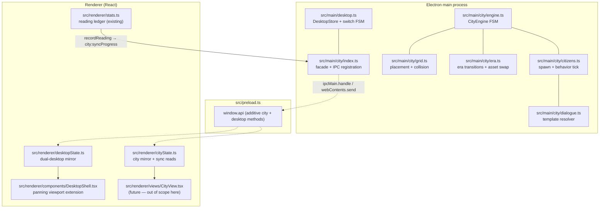
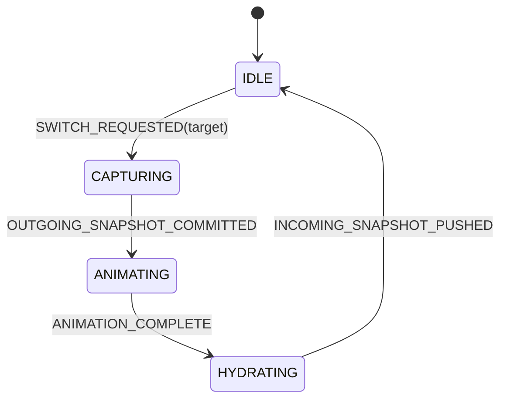
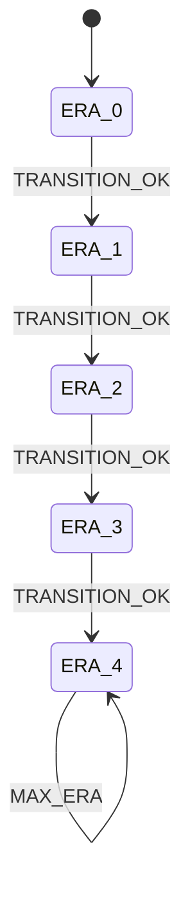

# SUPERSEDED

This document describes the obsolete Virtual City / City Points / grid-placement architecture.
It is preserved for historical reference only.

Canonical design now lives in src/main/city/docs/.

---

# CITY_ENGINE.md — Virtual City Progression System

| | |
|---|---|
| **Document** | Architectural and mathematical gameplay specification: Dual-Desktop Panning Workspace + Multi-Era Virtual City Progression Engine |
| **Version** | 1.0 (2026-07-07) |
| **Scope** | `src/` only — main-process city engine, preload bridge, renderer city mirror, dual-desktop shell extension. Zero changes to root configs (`forge.config`, `vite.*.config`, `tsconfig.json`). |
| **Design lineage** | CLAUDE.md (Fluent deep-red aesthetic, emoji prohibition, shell safety), SERVICES_PATCH.md (main-owned durable state, `domain:action` IPC, atomic JSON persistence, renderer mirrors) |
| **Status** | Design only. No implementation code ships with this document. |

---

## 0. Executive summary (plain language)

The Study OS desktop shell currently hosts a single full-viewport workspace with draggable windows, icons, and taskbar chrome — all persisted in renderer `localStorage`. This specification extends that shell into a **dual-desktop panning workspace**:

- **Desktop 0 (Left — Core Study):** Existing study tools (Library, Reader, Dictionary, Anki, Statistics, etc.). Window geometry and icon layout persist independently.
- **Desktop 1 (Right — Virtual City):** A 16×16 grid-based civilization builder whose economy is fueled exclusively by real reading activity. Characters and words read in the app convert deterministically into **City Points (CP)**. CP purchases buildings; buildings generate passive CP and unlock era transitions. AI citizens spawn proportional to city density and reading streak, perform era-appropriate tasks, and emit contextual dialogue derived from live reading statistics.

The main process owns all durable city and desktop-layout state. The renderer holds in-memory mirrors refreshed by IPC push events. Switching desktops triggers a horizontal slide animation; before the animation completes, the outgoing desktop's window snapshot is committed to the main store and the incoming desktop's snapshot is hydrated.

Nothing in this document modifies reader tinting, Anki connectors, or existing view internals. The city hooks into the existing `stats.ts` reading ledger as its sole CP input source.

---

## 1. Table of contents

- [2. Module topology](#2-module-topology)
- [3. Dual-desktop viewport and window snapshot persistence](#3-dual-desktop-viewport-and-window-snapshot-persistence)
- [4. Mathematical gameplay economy and data model](#4-mathematical-gameplay-economy-and-data-model)
- [5. Grid coordinate system](#5-grid-coordinate-system)
- [6. Multi-era evolution state engine](#6-multi-era-evolution-state-engine)
- [7. Deterministic AI citizen life cycle and behavior](#7-deterministic-ai-citizen-life-cycle-and-behavior)
- [8. Dialogue generation engine](#8-dialogue-generation-engine)
- [9. Windows 11 Fluent visual and IPC registry](#9-windows-11-fluent-visual-and-ipc-registry)
- [10. File-change manifest](#10-file-change-manifest)
- [11. Acceptance criteria matrix](#11-acceptance-criteria-matrix)
- [12. Deferred items](#12-deferred-items)

---

## 2. Module topology



Ownership rules:

| Store | Path | Writer | Reader |
|---|---|---|---|
| Desktop layout | `userData/desktop-layout.json` | `DesktopStore` (main) | Renderer mirror via IPC |
| City state | `userData/city-state.json` | `CityEngine` (main) | Renderer mirror via IPC |
| Reading stats | `localStorage` key `jp-study-stats-v1` | `stats.ts` (renderer) | `city:syncProgress` reads snapshot |

All main-process writes are atomic: write `*.tmp`, `fs.rename` to target.

---

## 3. Dual-desktop viewport and window snapshot persistence

### 3.1 Viewport geometry

The shell viewport is a single horizontal canvas of width `2W`, where `W` is the visible desktop width in CSS pixels (the `deskRef.clientWidth` value already used by `DesktopShell.tsx`).

```
┌──────────────────────────── W ────────────────────────────┬──────────────────────────── W ────────────────────────────┐
│                    desktop_index: 0                        │                    desktop_index: 1                        │
│                    Core Study (Left)                       │                    Virtual City (Right)                    │
│  x ∈ [0, W)                                                │  x ∈ [W, 2W)  (logical offset +W applied at render)       │
└────────────────────────────────────────────────────────────┴────────────────────────────────────────────────────────────┘
                              ▲
                    visible viewport clips to one W-wide slice
                    translateX = -activeDesktopIndex * W
```

| Constant | Value | Meaning |
|---|---|---|
| `DESKTOP_COUNT` | `2` | Fixed; not user-configurable in v1 |
| `DESKTOP_STUDY` | `0` | Core Study |
| `DESKTOP_CITY` | `1` | Virtual City |
| `SLIDE_DURATION_MS` | `380` | Horizontal pan animation duration |
| `SLIDE_EASING` | `cubic-bezier(0.32, 0.72, 0, 1)` | Windows 11-style deceleration curve |
| `TASKBAR_H` | `48` | Unchanged from existing shell |
| `MIN_WIN_W` | `260` | Unchanged |
| `MIN_WIN_H` | `170` | Unchanged |

### 3.2 Shared type definitions — new file `src/shared/desktop.ts`

```ts
/** Fixed desktop identifiers. */
export type DesktopIndex = 0 | 1;

export type WinSection =
  | 'library' | 'novels' | 'dictionary' | 'grammar' | 'translate'
  | 'player' | 'music' | 'anki' | 'flashcards' | 'stats' | 'resources'
  | 'settings' | 'note' | 'visualizer' | 'musicwidget'
  | 'city'; // Desktop 1 only

/** Per-window geometry snapshot. Coordinates are desktop-local (origin top-left of that desktop). */
export interface WindowSnapshot {
  id: string;
  section: WinSection;
  x: number;
  y: number;
  w: number;
  h: number;
  z: number;
  visible: boolean;   // false = minimized to taskbar
  maximized: boolean;
  /** Pre-maximize geometry; present iff maximized === true at time of snapshot. */
  restoreRect?: { x: number; y: number; w: number; h: number };
}

export interface IconSnapshot {
  id: string;
  kind: 'app' | 'shortcut' | 'action';
  section?: WinSection;
  target?: string;
  action?: 'note' | 'addapp' | 'city';
  name: string;
  glyph?: string;
  icon?: string; // data URL for shortcuts
  x: number;
  y: number;
}

export interface NoteSnapshot {
  id: string;
  text: string;
  color: string;
}

export interface WallpaperSnapshot {
  kind: 'preset' | 'image' | 'video';
  id?: string;    // preset id when kind === 'preset'
  path?: string;  // absolute path when kind === 'video'
}

/** One desktop's complete layout state. */
export interface DesktopLayout {
  desktopIndex: DesktopIndex;
  windows: WindowSnapshot[];
  icons: IconSnapshot[];
  notes: Record<string, NoteSnapshot>;
  wallpaper: WallpaperSnapshot;
  /** Monotonic counter incremented on every committed layout mutation. */
  layoutEpoch: number;
}

/** Durable store — userData/desktop-layout.json */
export interface DesktopLayoutStoreSchema {
  schemaVersion: 1;
  activeDesktopIndex: DesktopIndex;
  viewports: Record<DesktopIndex, DesktopLayout>;
  /** Shared across both desktops (clock, taskbar apps). */
  globalZTop: number;
}

/** Wire snapshot pushed to renderer. */
export interface DesktopLayoutSnapshot {
  activeDesktopIndex: DesktopIndex;
  viewports: DesktopLayout[];
  globalZTop: number;
  /** True while a slide animation is in progress (renderer should lock input). */
  switching: boolean;
}
```

### 3.3 Seed layout definitions

Desktop 0 seeds from the current `defaultIcons()` + empty windows (matching today's first-boot behavior). Desktop 1 seeds with a single `city` icon and no windows:

```ts
export const SEED_DESKTOP_CITY_ICONS: IconSnapshot[] = [
  {
    id: 'app-city',
    kind: 'app',
    section: 'city',
    name: 'City',
    glyph: 'stats', // reuse existing line-glyph; dedicated city glyph added in Icons.tsx later
    x: 16,
    y: 16,
  },
];

export const SEED_WALLPAPER: WallpaperSnapshot = { kind: 'preset', id: 'crimsonveil' };
```

### 3.4 Desktop switch state machine

Lives in `src/main/desktop.ts`. Serializes concurrent switch requests (last-wins, identical to profile switch semantics in SERVICES_PATCH.md section 4.4).



| # | From | Event | Guard | Actions | To |
|---|---|---|---|---|---|
| D1 | IDLE | `SWITCH_REQUESTED(idx)` | `idx ∈ {0,1}` && `idx ≠ activeDesktopIndex` | set `switching = true`; push `desktop:changed { switching: true }`; return ack to caller | CAPTURING |
| D2 | CAPTURING | `OUTGOING_SNAPSHOT_COMMITTED` | renderer sent `desktop:commitLayout` for outgoing index | atomic persist outgoing layout; set `activeDesktopIndex = idx` | ANIMATING |
| D3 | ANIMATING | `ANIMATION_COMPLETE` | `elapsed >= SLIDE_DURATION_MS` | load incoming layout snapshot | HYDRATING |
| D4 | HYDRATING | `INCOMING_SNAPSHOT_PUSHED` | — | push `desktop:changed { switching: false, activeDesktopIndex }`; set `switching = false` | IDLE |
| D5 | IDLE | `SWITCH_REQUESTED(idx)` | `idx === activeDesktopIndex` | no-op; return current snapshot | IDLE |
| D6 | any | `LAYOUT_MUTATION` | not switching | merge patch into active desktop; increment `layoutEpoch`; atomic persist; push `desktop:changed` | per state |

**Lifecycle rules:**

1. **Pre-switch capture:** Renderer calls `desktop:commitLayout` with the full `DesktopLayout` for the outgoing desktop *before* starting the CSS `translateX` animation. Main persists atomically.
2. **Animation lock:** While `switching === true`, window drag/resize/open/close IPC mutations on either desktop are rejected with `{ ok: false, error: 'desktop-switch-in-progress' }`.
3. **Post-switch hydrate:** Renderer receives the incoming desktop's layout via the `desktop:changed` push and applies it to local React state. Windows that exist on Desktop 0 but not Desktop 1 are unmounted (not destroyed in store — they remain in Desktop 0's snapshot).
4. **Independent persistence:** Each `DesktopLayout` maintains its own `windows[]`, `icons[]`, `notes{}`, `wallpaper`. Mutations always target `viewports[activeDesktopIndex]` unless an explicit `desktopIndex` is provided in `desktop:commitLayout`.
5. **Migration:** On first boot after upgrade, `DesktopStore` reads legacy `localStorage` keys (`jp-os-wins`, `jp-os-icons`, `jp-os-wall`, `jp-desktop-notes`) via a one-shot `desktop:migrateLegacy` handshake (mirrors `profile:migrateLegacy` pattern) and folds them into `viewports[0]`. Desktop 1 receives seed layout.

### 3.5 Coordinate transform at render time

Window and icon coordinates stored in snapshots are **desktop-local** (origin at top-left of that desktop, `x ∈ [0, W)`). At render:

```
renderX = snapshot.x + (desktopIndex * W)
renderY = snapshot.y
```

The shell applies `transform: translateX(-activeDesktopIndex * W)` on the panning container. Individual element positions use desktop-local coords; the container offset handles viewport translation.

### 3.6 Desktop store invariants

| # | Invariant |
|---|---|
| DL-1 | Exactly one `activeDesktopIndex` at all times. |
| DL-2 | Every persist is atomic (temp + rename). |
| DL-3 | Exactly one `desktop:changed` push per committed mutation or switch completion. |
| DL-4 | `layoutEpoch` is monotonic per desktop; never decrements. |
| DL-5 | Desktop switch rejects all layout mutations until IDLE (D6 guard). |
| DL-6 | `globalZTop` is shared; focus on any desktop increments it. Z-order does not leak across desktops. |

---

## 4. Mathematical gameplay economy and data model

### 4.1 Core currency: City Points (CP)

CP is an integer currency stored in main-process city state. CP is **earned** from reading activity and **spent** on building placement and upgrades. CP balance never goes negative.

### 4.2 Reading input signals

The city engine consumes reading deltas from the existing stats ledger (`src/renderer/stats.ts`):

| Signal | Source field | Unit |
|---|---|---|
| `Δchars` | `DayEntry.chars` delta since last sync | characters |
| `Δwords` | Tokenized unique word count delta since last sync | words |
| `S` | `computeStreak(days)` | consecutive calendar days |
| `todayChars` | Today's cumulative `DayEntry.chars` | characters |
| `jlptTarget` | Active profile `deckParams.jlptTarget` | `N5`..`N1` |

Word counting for `Δwords` uses the same kuromoji content-token pipeline as `tokenizer.ts`, applied to newly-read text segments only (the reader passes `{ chars, words }` in the sync payload; main does not re-tokenize).

### 4.3 CP generation formula (exact)

**Constants (compile-time, exported from `src/shared/city.ts`):**

```ts
export const CP_ALPHA = 0.02;    // CP per character
export const CP_BETA  = 0.15;    // CP per unique word token
export const CP_GAMMA = 0.75;    // asymptotic streak bonus cap (+75%)
export const CP_DELTA = 0.12;    // streak curve sensitivity
export const CP_MIN_AWARD = 1;   // floor: any qualifying sync awards at least 1 CP
```

**Streak multiplier:**

```
M_streak(S) = 1 + γ * (1 - e^(-δ * S))

where:
  γ = CP_GAMMA = 0.75
  δ = CP_DELTA = 0.12
  S = integer streak ≥ 0
```

**Per-sync CP award:**

```
rawCP = α * Δchars + β * Δwords

CP_awarded = max(CP_MIN_AWARD, floor(rawCP * M_streak(S)))    if (Δchars > 0 || Δwords > 0)
           = 0                                                 otherwise
```

**Worked examples:**

| Δchars | Δwords | S | rawCP | M_streak(S) | CP_awarded |
|---|---|---|---|---|---|
| 500 | 40 | 0 | 10 + 6 = 16 | 1.000 | 16 |
| 500 | 40 | 7 | 16 | 1 + 0.75*(1-e^-0.84) = 1.568 | floor(25.09) = 25 |
| 500 | 40 | 30 | 16 | 1 + 0.75*(1-e^-3.6) = 1.735 | floor(27.76) = 27 |
| 25 | 2 | 14 | 0.5 + 0.3 = 0.8 | 1.631 | max(1, floor(1.30)) = 1 |
| 0 | 0 | 10 | 0 | — | 0 |

**Passive CP generation from buildings** (see section 4.5) ticks on a separate timer (section 4.6) and uses the same `M_streak(S)` multiplier.

### 4.4 City state schema — new file `src/shared/city.ts`

```ts
export type EraId = 0 | 1 | 2 | 3 | 4;

export const ERA_NAMES: Record<EraId, string> = {
  0: 'Stone Age',
  1: 'Bronze Age',
  2: 'Industrial Era',
  3: 'Cyberpunk Metropolis',
  4: 'Space Colony',
};

export type BuildingCategory = 'residential' | 'production' | 'civic';

/** Stable identity across eras — used for upgrade routing and statistics. */
export type BuildingLineId = 'housing' | 'workshop' | 'civic-hall';

export interface BuildingInstance {
  /** UUID v4, immutable from placement through all era swaps. */
  instanceId: string;
  lineId: BuildingLineId;
  category: BuildingCategory;
  /** Current era-specific asset id (changes on era transition). */
  assetId: string;
  era: EraId;
  level: number;          // 1..3
  gridX: number;          // anchor cell, 0..15
  gridY: number;          // anchor cell, 0..15
  footprintW: number;
  footprintH: number;
  placedAt: number;       // epoch ms
  /** Cumulative CP earned by this building (never reset on era swap). */
  lifetimeCpGenerated: number;
}

export interface CityProgressLedger {
  /** Characters processed into CP since install. */
  totalCharsConverted: number;
  /** Words processed into CP since install. */
  totalWordsConverted: number;
  /** CP earned from reading (not passive). */
  totalCpFromReading: number;
  /** CP earned from building passive ticks. */
  totalCpFromBuildings: number;
  /** CP spent on placement and upgrades. */
  totalCpSpent: number;
  /** Last reading sync timestamp. */
  lastSyncAt: number;
  /** Per-day CP earned (key = YYYY-MM-DD local). */
  dailyCp: Record<string, number>;
}

export interface CityStoreSchema {
  schemaVersion: 1;
  era: EraId;
  cpBalance: number;
  buildings: BuildingInstance[];
  /** Set of BuildingLineId values ever constructed (for era gates). */
  uniqueLinesBuilt: BuildingLineId[];
  citizens: CitizenState[];       // section 7
  progress: CityProgressLedger;
  /** Monotonic; incremented on every mutation. */
  cityEpoch: number;
  /** Last processed stats cursor to compute deltas. */
  statsCursor: {
    lastDayKey: string;
    lastTodayChars: number;
    lastTodayWords: number;
    lastStreak: number;
  };
}

export interface CitySnapshot {
  era: EraId;
  cpBalance: number;
  buildings: BuildingInstance[];
  citizens: CitizenState[];
  progress: CityProgressLedger;
  cityEpoch: number;
  /** Next era transition requirements with current progress (for UI). */
  eraGate: EraGateStatus;
}
```

### 4.5 Balancing matrix — 3 building lines × 5 eras

Each building line has a footprint (grid cells), placement cost in CP, prerequisites, passive CP/hour rate at level 1, and per-level multipliers.

**Level multiplier (all lines, all eras):**

```
L_mult(level) = 1 + 0.35 * (level - 1)

level ∈ {1, 2, 3}
L_mult(1) = 1.00
L_mult(2) = 1.35
L_mult(3) = 1.70
```

**Upgrade cost from level N to N+1:**

```
upgradeCost = floor(placeCost * 0.6 * L_mult(N))
```

**Passive CP per hour (building tick):**

```
passiveCpPerHour = basePassiveRate * L_mult(level) * M_streak(S)

where basePassiveRate comes from the matrix below.
```

#### 4.5.1 Housing line (`lineId: 'housing'`, category: `residential`)

| Era | EraId | assetId | Footprint | placeCost (CP) | basePassiveRate (CP/h) | Prerequisites |
|---|---|---|---|---|---|---|
| Stone Age | 0 | `sa-hut` | 1×1 | 50 | 2 | none |
| Bronze Age | 1 | `ba-courtyard` | 1×2 | 180 | 6 | `sa-hut` ×1 placed |
| Industrial Era | 2 | `in-tenement` | 2×2 | 600 | 18 | `ba-courtyard` ×1 placed |
| Cyberpunk Metropolis | 3 | `cp-sleeve` | 2×3 | 2,400 | 55 | `in-tenement` ×2 placed |
| Space Colony | 4 | `sc-hab-pod` | 2×2 | 9,000 | 140 | `cp-sleeve` ×2 placed |

#### 4.5.2 Workshop line (`lineId: 'workshop'`, category: `production`)

| Era | EraId | assetId | Footprint | placeCost (CP) | basePassiveRate (CP/h) | Prerequisites |
|---|---|---|---|---|---|---|
| Stone Age | 0 | `sa-workshop` | 2×1 | 80 | 3 | `sa-hut` ×1 placed |
| Bronze Age | 1 | `ba-forge` | 2×2 | 250 | 9 | `ba-courtyard` ×1 placed |
| Industrial Era | 2 | `in-factory` | 3×2 | 900 | 28 | `in-tenement` ×1 placed |
| Cyberpunk Metropolis | 3 | `cp-fab-lab` | 3×3 | 3,200 | 72 | `in-factory` ×1 placed |
| Space Colony | 4 | `sc-nano-bay` | 3×2 | 12,000 | 185 | `cp-fab-lab` ×1 placed |

#### 4.5.3 Civic Hall line (`lineId: 'civic-hall'`, category: `civic`)

| Era | EraId | assetId | Footprint | placeCost (CP) | basePassiveRate (CP/h) | Prerequisites |
|---|---|---|---|---|---|---|
| Stone Age | 0 | `sa-council` | 2×2 | 120 | 1 | `sa-hut` ×2 placed |
| Bronze Age | 1 | `ba-ziggurat` | 3×2 | 400 | 4 | `ba-forge` ×1 placed |
| Industrial Era | 2 | `in-townhall` | 3×3 | 1,200 | 12 | `in-factory` ×1 placed |
| Cyberpunk Metropolis | 3 | `cp-core` | 4×3 | 4,500 | 30 | `cp-fab-lab` ×1 placed |
| Space Colony | 4 | `sc-gov-dome` | 4×4 | 16,000 | 80 | `sc-nano-bay` ×1 placed |

Civic buildings generate less passive CP but are **required** for era transition gates (section 6). Production buildings generate the most passive CP. Residential buildings are the cheapest entry point.

**Placement validation** uses the grid system (section 5). Prerequisites are evaluated against `buildings[]` in the **current** era (after asset swap, assetId changes but `lineId` persists).

### 4.6 Passive tick scheduler

```
TICK_INTERVAL_MS = 60_000   // 1 minute real-time

perTickCp(building) = floor(passiveCpPerHour(building) / 60)

On each tick:
  for each building b:
    award = perTickCp(b) * M_streak(S)
    cpBalance += award
    b.lifetimeCpGenerated += award
    progress.totalCpFromBuildings += award
```

Ticks run in the main process via `setInterval`. Ticks are suppressed while `city-state.json` is mid-write. On app resume after suspend, at most one catch-up tick fires per building per elapsed hour (cap: 24 h backlog).

### 4.7 Purchase flow (deterministic)

```
purchaseBuilding(lineId, gridX, gridY):
  def = BUILDING_MATRIX[era][lineId]
  assert prerequisites satisfied
  assert canPlace(lineId, gridX, gridY)     // section 5
  assert cpBalance >= def.placeCost
  cpBalance -= def.placeCost
  progress.totalCpSpent += def.placeCost
  buildings.push(new BuildingInstance { ... })
  uniqueLinesBuilt.add(lineId)
  recomputeCitizenTarget()                  // section 7
  persist; push city:changed
```

---

## 5. Grid coordinate system

### 5.1 Spatial schema

The city occupies a fixed **16×16** cell matrix.

```ts
export const GRID_SIZE = 16;
export type GridCell = 0 | 1 | 2 | 3 | 4 | 5 | 6 | 7 | 8 | 9 | 10 | 11 | 12 | 13 | 14 | 15;

export interface GridCoord {
  x: GridCell;
  y: GridCell;
}

/** Occupancy map — derived at runtime, not persisted. */
export type OccupancyMatrix = (BuildingInstance | null)[][];
// occupancy[y][x] — row-major, origin top-left
```

### 5.2 Footprint and anchor

Each building anchors at top-left cell `(gridX, gridY)` and occupies a rectangle:

```
occupied(x, y) = (x, y) such that
  gridX ≤ x < gridX + footprintW
  gridY ≤ y < gridY + footprintH
  x, y ∈ [0, 15]
```

### 5.3 Placement validation (`canPlace`)

```
canPlace(lineId, gridX, gridY):
  def = BUILDING_MATRIX[era][lineId]
  if gridX + def.footprintW > GRID_SIZE: return false
  if gridY + def.footprintH > GRID_SIZE: return false
  rebuild occupancy from buildings[]
  for each cell (x, y) in footprint:
    if occupancy[y][x] !== null: return false
  return true
```

### 5.4 Collision detection

Collision is **exact cell overlap**. Two buildings may not share any cell. Diagonal adjacency is permitted.

### 5.5 Upgrade routing

Upgrades are in-place mutations; footprint may grow.

```
upgradeBuilding(instanceId):
  b = find(instanceId)
  assert b.level < 3
  def = BUILDING_MATRIX[b.era][b.lineId]
  newLevel = b.level + 1
  cost = floor(def.placeCost * 0.6 * L_mult(b.level))
  assert cpBalance >= cost

  // Footprint growth check (levels 2 and 3 may expand per matrix)
  newFootprint = FOOTPRINT_BY_LEVEL[b.era][b.lineId][newLevel]
  assert canPlaceExcluding(b.lineId, b.gridX, b.gridY, newFootprint, excludeId=b.instanceId)

  cpBalance -= cost
  b.level = newLevel
  b.footprintW = newFootprint.w
  b.footprintH = newFootprint.h
  persist; push city:changed
```

**Footprint growth table (only cells that change):**

| Line | Level 1 | Level 2 | Level 3 |
|---|---|---|---|
| housing | matrix default | same | +1 width (max 3) |
| workshop | matrix default | +1 height | +1 width |
| civic-hall | matrix default | +1 width | +1 height |

If growth would exceed grid bounds or collide, upgrade is rejected.

### 5.6 Coordinate persistence through era transitions

`gridX`, `gridY`, `footprintW`, `footprintH` are **never modified** during era asset swap (section 6). Only `assetId` and `era` fields change. `lifetimeCpGenerated` is preserved.

---

## 6. Multi-era evolution state engine

### 6.1 Era state machine



Era is stored as `era: EraId` in `city-state.json`. Era 4 is terminal.

### 6.2 Era transition check — exact numeric milestones

An **Era Transition Check** evaluates when any of these events occur:

- `city:purchaseBuilding` succeeds
- `city:syncProgress` awards CP
- `city:upgradeBuilding` succeeds
- Manual invoke `city:checkEraTransition`

```
checkEraTransition():
  nextEra = era + 1
  if nextEra > 4: return { ok: false, reason: 'max-era' }

  gate = ERA_GATES[nextEra]
  status = {
    cpSpentOk:     progress.totalCpSpent >= gate.minCpSpent,
    buildingsOk:   countUniqueLines() >= gate.minUniqueLines,
    civicOk:       countByLine('civic-hall') >= gate.minCivicCount,
    streakOk:      currentStreak >= gate.minStreak,
    housingOk:     countByLine('housing') >= gate.minHousingCount,
  }
  if all(status values true):
    executeEraTransition(nextEra)
    return { ok: true, newEra: nextEra }
  return { ok: false, gate, status }
```

**Era gate table:**

| Target Era | Name | minCpSpent | minUniqueLines | minCivicCount | minHousingCount | minStreak |
|---|---|---|---|---|---|---|
| 1 | Bronze Age | 400 | 2 | 1 | 2 | 3 |
| 2 | Industrial Era | 2,500 | 3 | 1 | 3 | 7 |
| 3 | Cyberpunk Metropolis | 12,000 | 3 | 1 | 4 | 14 |
| 4 | Space Colony | 50,000 | 3 | 1 | 5 | 21 |

`countUniqueLines()` uses `uniqueLinesBuilt` (historical — includes prior-era constructions). `countByLine(id)` counts buildings with matching `lineId` in the **current** era after the last transition.

### 6.3 Asset swapping contract

On `executeEraTransition(newEra)`:

```
for each building b in buildings:
  b.era = newEra
  b.assetId = BUILDING_MATRIX[newEra][b.lineId].assetId
  // gridX, gridY, footprintW, footprintH, level, instanceId, lifetimeCpGenerated: UNCHANGED

era = newEra
cityEpoch++
persist atomically
push city:eraTransitioned { oldEra, newEra, buildings }
push city:changed
recomputeCitizenTarget()
```

**Example:** Stone Age `sa-hut` at `[4, 2]` with `instanceId = "a1b2..."` becomes Space Colony `sc-hab-pod` at `[4, 2]` with the same `instanceId` when the civilization reaches Era 4. Statistics reflect cumulative `lifetimeCpGenerated` across all eras.

### 6.4 Era gate wire type

```ts
export interface EraGateStatus {
  nextEra: EraId | null;  // null when era === 4
  requirements: {
    minCpSpent: number;
    minUniqueLines: number;
    minCivicCount: number;
    minHousingCount: number;
    minStreak: number;
  };
  progress: {
    totalCpSpent: number;
    uniqueLines: number;
    civicCount: number;
    housingCount: number;
    streak: number;
  };
  satisfied: boolean;
}
```

---

## 7. Deterministic AI citizen life cycle and behavior

### 7.1 Citizen state schema

```ts
export type CitizenTask =
  // Era 0 — Stone Age
  | 'hunt' | 'gather' | 'rest'
  // Era 1 — Bronze Age
  | 'farm' | 'smelt' | 'patrol'
  // Era 2 — Industrial Era
  | 'commute' | 'assemble' | 'maintain'
  // Era 3 — Cyberpunk Metropolis
  | 'hack' | 'deliver' | 'monitor'
  // Era 4 — Space Colony
  | 'thruster-maint' | 'hydro-tend' | 'orbit-shift';

export interface CitizenState {
  citizenId: string;       // deterministic: hash(instanceId + index)
  homeBuildingId: string;  // instanceId of residential building
  workBuildingId: string | null;
  /** World position in city viewport pixels (not grid cells). */
  pos: { x: number; y: number };
  /** Target waypoint in pixels. */
  target: { x: number; y: number };
  task: CitizenTask;
  taskPhase: number;       // 0..1 progress within current task cycle
  /** Milliseconds per complete task cycle. */
  taskDurationMs: number;
  /** Seed for deterministic pseudo-random routing. */
  rngSeed: number;
  spawnedAt: number;
}
```

### 7.2 Spawning rules (exact)

**City density:**

```
occupiedCells = count of non-null cells in occupancy matrix
ρ = occupiedCells / (GRID_SIZE * GRID_SIZE)    // ∈ [0, 1]
```

**Citizen target count:**

```
CITIZEN_CAP = 48
ε = 0.65
ζ = 0.10

citizenTarget = min(CITIZEN_CAP, floor(ρ * GRID_SIZE * (1 + ε * tanh(ζ * S))))
```

**Worked examples (GRID_SIZE = 16, 256 cells):**

| occupiedCells | ρ | S | inner | citizenTarget |
|---|---|---|---|---|
| 32 | 0.125 | 0 | 16 * 1.0 | 2 |
| 64 | 0.250 | 7 | 16 * 1.416 | 22 |
| 128 | 0.500 | 14 | 16 * 1.546 | 24 |
| 200 | 0.781 | 30 | 16 * 1.635 | 26 |

**Spawn/despawn reconciliation (on building change or era transition):**

```
reconcileCitizens():
  target = citizenTarget
  current = citizens.length
  if current < target:
    for i in current..target-1:
      home = pickResidentialBuilding(deterministicIndex=i)
      citizens.push(spawnCitizen(home, i))
  if current > target:
    citizens = citizens.slice(0, target)   // despawn highest-index first
```

`pickResidentialBuilding` cycles through `buildings.filter(b => b.category === 'residential')` by `i % count`.

### 7.3 Behavior tick (deterministic, 200 ms)

Main process runs `citizenTick()` every `200 ms`:

```
for each citizen c:
  dt = 200
  c.taskPhase += dt / c.taskDurationMs
  if c.taskPhase >= 1:
    c.taskPhase = 0
    c.task = nextTask(c, era)           // era-specific cycle
    c.target = waypointFor(c.task, c)   // deterministic from rngSeed

  // Linear interpolation toward target
  speed = CITIZEN_SPEED_PX_PER_SEC = 28
  dir = normalize(c.target - c.pos)
  c.pos += dir * speed * (dt / 1000)
```

**Task cycle per era:**

| Era | Task rotation (repeating) |
|---|---|
| 0 | hunt → gather → rest |
| 1 | farm → smelt → patrol |
| 2 | commute → assemble → maintain |
| 3 | hack → deliver → monitor |
| 4 | thruster-maint → hydro-tend → orbit-shift |

`taskDurationMs` per task = `8000 + (rngSeed % 4000)` (range 8–12 s).

**Work assignment:**

```
workBuildingId = first production building where hash(citizenId) % productionCount === index
                 or null if no production buildings exist
```

---

## 8. Dialogue generation engine

### 8.1 Design constraints

- No decorative emojis (CLAUDE.md strict prohibition).
- Strings are composed from **template slots** filled with live data from reading statistics and active profile JLPT target.
- Dialogue is regenerated on `city:syncProgress` and on citizen task phase rollover (max 1 line per citizen per 8 s).

### 8.2 Template schema

```ts
export interface DialogueContext {
  streak: number;
  todayChars: number;
  todayCp: number;
  totalCp: number;
  era: EraId;
  eraName: string;
  jlptTarget: string;          // 'N2' etc. from active profile
  knownWordCount: number;      // lemmas at WkLevel >= 3 (rollup from knownWords mirror)
  learningWordCount: number;   // lemmas at WkLevel 1..2
  activeBookTitle: string | null;
  buildingCount: number;
  citizenTask: CitizenTask;
}

export interface DialogueTemplate {
  id: string;
  era: EraId | 'any';
  task: CitizenTask | 'any';
  /** Mustache-style slots: {{streak}}, {{todayChars}}, {{jlptTarget}}, etc. */
  template: string;
  weight: number;
}
```

### 8.3 Selection algorithm

```
generateDialogue(citizen, ctx):
  pool = templates.filter(t =>
    (t.era === 'any' || t.era === ctx.era) &&
    (t.task === 'any' || t.task === citizen.task)
  )
  idx = fnv1a(citizen.citizenId + floor(Date.now() / 8000)) % sum(pool.weight)
  pick weighted template
  return interpolate(template, ctx)
```

`interpolate` replaces `{{slot}}` with `formatNumber(ctx[slot])` for numeric fields or string value for text fields. Missing slots render as empty string (never throw).

### 8.4 Seed template library (minimum set)

| id | era | task | template |
|---|---|---|---|
| `d-sa-hunt-1` | 0 | hunt | `Streak {{streak}} days. I hunt while you read {{todayChars}} characters today.` |
| `d-sa-gather-1` | 0 | gather | `We stockpile knowledge like grain. {{knownWordCount}} words marked known.` |
| `d-ba-smelt-1` | 1 | smelt | `Bronze hardens at {{totalCp}} City Points. Keep forging ahead.` |
| `d-in-commute-1` | 2 | commute | `Shift change. You are targeting {{jlptTarget}} — {{learningWordCount}} words still learning.` |
| `d-cp-hack-1` | 3 | hack | `Neural link sync: {{todayCp}} CP logged today. Uplink stable.` |
| `d-sc-orbit-1` | 4 | orbit-shift | `Orbital correction burn. {{activeBookTitle}} is on today's manifest.` |
| `d-any-rest-1` | any | rest | `Rest cycle. {{streak}}-day streak holding.` |

Templates are stored in `src/shared/cityDialogue.ts` as a typed constant array. Additional templates may be added without schema changes.

---

## 9. Windows 11 Fluent visual and IPC registry

### 9.1 Visual design tokens (city viewport)

All city UI extends the existing Study OS token set from `styles.css`. No new fill-heavy palettes.

| Token | Value | Usage |
|---|---|---|
| `--bg` | `#0f0e13` | City ground plane |
| `--panel` | `#17161d` | Building panels, shop sidebar |
| `--panel-2` | `#211f29` | Elevated cards |
| `--accent` | `#ff2e4d` | Selected building outline, CP badge, era progress fill |
| `--accent-2` | `#ff6b81` | Hover outlines, active citizen path |
| `--red-deep` | `#d21734` | Era transition flash accent |
| `--border` | `#2d2b37` | Grid lines, building footprints |
| `--muted` | `#9d97a6` | Secondary labels, coordinates |
| `--text` | `#f5f4f7` | Primary labels |

**Fluent rules for city surfaces:**

- **Mica-like panels:** `background: color-mix(in srgb, var(--panel) 82%, transparent)` with `backdrop-filter: blur(24px)` on overlays only (performance: max 2 blurred layers visible).
- **No internal window titles** inside city panels (CLAUDE.md window minimalism). Taskbar button identifies context.
- **No decorative emojis** anywhere in city UI, dialogue bubbles, or shop text.
- **Icons:** Reuse `Icons.tsx` line-glyphs only. Building thumbnails are CSS/SVG geometric silhouettes per era, not emoji.
- **Grid rendering:** 1 px lines at `rgba(255, 255, 255, 0.06)`. Occupied cells get `box-shadow: inset 0 0 0 1px var(--accent)` on hover.
- **Era transition:** 600 ms cross-fade on building sprites. Brief `rgba(255, 46, 77, 0.12)` full-viewport flash on `city:eraTransitioned`.
- **Desktop pan:** `transform: translateX()` on `.os-desktop-pan` container; `will-change: transform` during animation only.
- **Typography:** Segoe UI stack (inherited). CP values use `font-variant-numeric: tabular-nums`.

### 9.2 City viewport layout (Desktop 1)

```
┌────────────────────────────────────────────────────────────── W ──┐
│ [Grid 16×16 — center]              │ [Shop sidebar — 280px]     │
│  Building sprites + citizens       │  Building cards            │
│  CP badge top-left                 │  Era gate progress         │
│  Era label top-center              │  CP balance                │
├────────────────────────────────────┴────────────────────────────┤
│ Taskbar (shared, 48px) — includes City app button on Desktop 1  │
└─────────────────────────────────────────────────────────────────┘
```

The city grid occupies `W - 280` px. Cell pixel size = `floor((W - 280 - 32) / 16)` (32 px total horizontal padding).

### 9.3 IPC channel registry

Follows `domain:action` invoke, `domain:changed` push convention (SERVICES_PATCH.md section 6).

| Channel | Kind | Direction | Request payload | Response / push payload |
|---|---|---|---|---|
| `desktop:getLayout` | invoke | R → M | — | `DesktopLayoutSnapshot` |
| `desktop:commitLayout` | invoke | R → M | `{ desktopIndex, layout: DesktopLayout }` | `{ ok: boolean; error?: string }` |
| `desktop:switch` | invoke | R → M | `{ targetIndex: DesktopIndex }` | `{ ok: boolean; error?: string; snapshot: DesktopLayoutSnapshot }` |
| `desktop:migrateLegacy` | invoke | R → M | `{ wins?, icons?, notes?, wall? }` | `DesktopLayoutSnapshot` |
| `desktop:changed` | push | M → R | — | `DesktopLayoutSnapshot` |
| `city:getLayout` | invoke | R → M | — | `CitySnapshot` |
| `city:purchaseBuilding` | invoke | R → M | `{ lineId: BuildingLineId; gridX: GridCell; gridY: GridCell }` | `{ ok: boolean; error?: string; snapshot?: CitySnapshot; cpAwarded?: number }` |
| `city:upgradeBuilding` | invoke | R → M | `{ instanceId: string }` | `{ ok: boolean; error?: string; snapshot?: CitySnapshot }` |
| `city:syncProgress` | invoke | R → M | `CitySyncPayload` | `{ ok: boolean; cpAwarded: number; snapshot: CitySnapshot }` |
| `city:getCitizens` | invoke | R → M | — | `{ citizens: CitizenState[]; dialogues: Record<string, string> }` |
| `city:checkEraTransition` | invoke | R → M | — | `{ ok: boolean; newEra?: EraId; gate?: EraGateStatus }` |
| `city:changed` | push | M → R | — | `CitySnapshot` |
| `city:eraTransitioned` | push | M → R | — | `{ oldEra: EraId; newEra: EraId; buildings: BuildingInstance[] }` |
| `city:citizensChanged` | push | M → R | — | `{ citizens: CitizenState[]; dialogues: Record<string, string> }` |

**`CitySyncPayload`:**

```ts
export interface CitySyncPayload {
  dayKey: string;           // YYYY-MM-DD local
  todayChars: number;       // cumulative today
  todayWords: number;       // cumulative today
  streak: number;
  deltaChars: number;       // since last sync
  deltaWords: number;       // since last sync
  jlptTarget?: string;
  knownWordCount: number;
  learningWordCount: number;
  activeBookTitle?: string | null;
}
```

`city:syncProgress` is called by the renderer after each `recordReading()` flush (same cadence as stats persistence in `BookReader.tsx` / `NovelReader.tsx`).

### 9.4 Preload additions (`window.api`, purely additive)

```ts
// Desktop
desktopGetLayout(): Promise<DesktopLayoutSnapshot>;
desktopCommitLayout(desktopIndex: DesktopIndex, layout: DesktopLayout):
  Promise<{ ok: boolean; error?: string }>;
desktopSwitch(targetIndex: DesktopIndex):
  Promise<{ ok: boolean; error?: string; snapshot: DesktopLayoutSnapshot }>;
desktopMigrateLegacy(v: { wins?: unknown; icons?: unknown; notes?: unknown; wall?: unknown }):
  Promise<DesktopLayoutSnapshot>;
onDesktopChanged(cb: (snap: DesktopLayoutSnapshot) => void): () => void;

// City
cityGetLayout(): Promise<CitySnapshot>;
cityPurchaseBuilding(req: { lineId: BuildingLineId; gridX: GridCell; gridY: GridCell }):
  Promise<{ ok: boolean; error?: string; snapshot?: CitySnapshot }>;
cityUpgradeBuilding(instanceId: string):
  Promise<{ ok: boolean; error?: string; snapshot?: CitySnapshot }>;
citySyncProgress(payload: CitySyncPayload):
  Promise<{ ok: boolean; cpAwarded: number; snapshot: CitySnapshot }>;
cityGetCitizens():
  Promise<{ citizens: CitizenState[]; dialogues: Record<string, string> }>;
cityCheckEraTransition():
  Promise<{ ok: boolean; newEra?: EraId; gate?: EraGateStatus }>;
onCityChanged(cb: (snap: CitySnapshot) => void): () => void;
onCityEraTransitioned(cb: (ev: { oldEra: EraId; newEra: EraId; buildings: BuildingInstance[] }) => void): () => void;
onCityCitizensChanged(cb: (ev: { citizens: CitizenState[]; dialogues: Record<string, string> }) => void): () => void;
```

### 9.5 Renderer mirrors

**`src/renderer/desktopState.ts`** — follows `profileState.ts` pattern:

```ts
export const DESKTOP_EVENT = 'desktop-changed';

export function initDesktopState(): Promise<void>;
export function getActiveDesktopIndex(): DesktopIndex;
export function getDesktopLayout(index: DesktopIndex): DesktopLayout;
export function switchDesktop(target: DesktopIndex): Promise<{ ok: boolean; error?: string }>;
export function commitLayout(index: DesktopIndex, layout: DesktopLayout): Promise<void>;
export function onDesktopChanged(cb: (snap: DesktopLayoutSnapshot) => void): () => void;
```

**`src/renderer/cityState.ts`** — follows same pattern:

```ts
export const CITY_EVENT = 'city-changed';

export function initCityState(): Promise<void>;
export function getCitySnapshot(): CitySnapshot;
export function syncCityProgress(payload: CitySyncPayload): Promise<{ cpAwarded: number }>;
export function onCityChanged(cb: (snap: CitySnapshot) => void): () => void;
export function onCitizensChanged(cb: (ev: { citizens: CitizenState[]; dialogues: Record<string, string> }) => void): () => void;
```

### 9.6 Engine invariants

| # | Invariant |
|---|---|
| C-1 | Main process is the sole writer of `city-state.json` and `desktop-layout.json`. |
| C-2 | CP balance is always a non-negative integer. |
| C-3 | `cityEpoch` and per-desktop `layoutEpoch` are monotonic. |
| C-4 | Era transitions are idempotent: if already at target era, no-op. |
| C-5 | Asset swap preserves `instanceId`, grid coordinates, level, and `lifetimeCpGenerated`. |
| C-6 | Citizen count never exceeds `CITIZEN_CAP` (48). |
| C-7 | All dialogue output passes through the template engine; no free-form generative text in v1. |
| C-8 | Desktop switch and city passive tick never run concurrently with atomic persist (mutex). |
| C-9 | `city:syncProgress` is the only channel that awards reading-derived CP; renderer cannot set CP directly. |
| C-10 | Shell safety: `DesktopShell.tsx` drag layer, taskbar, and icon grid behavior on Desktop 0 remain functionally identical after migration. |

---

## 10. File-change manifest

| Path | Change |
|---|---|
| `src/shared/desktop.ts` | **new** — section 3.2 types + seeds |
| `src/shared/city.ts` | **new** — sections 4.3–4.5 types, constants, building matrix |
| `src/shared/cityDialogue.ts` | **new** — section 8.4 template library |
| `src/main/desktop.ts` | **new** — DesktopStore, switch FSM, `registerDesktopIpc()` |
| `src/main/city/engine.ts` | **new** — CityEngine FSM, CP ledger |
| `src/main/city/grid.ts` | **new** — placement, collision, occupancy |
| `src/main/city/era.ts` | **new** — era gates, asset swap |
| `src/main/city/citizens.ts` | **new** — spawn, tick, reconcile |
| `src/main/city/dialogue.ts` | **new** — template resolver |
| `src/main/city/index.ts` | **new** — facade, `registerCityIpc()`, passive tick |
| `src/renderer/desktopState.ts` | **new** — desktop mirror |
| `src/renderer/cityState.ts` | **new** — city mirror |
| `src/main.ts` | **modified (2 lines)** — `registerDesktopIpc()` + `registerCityIpc()` in `app.whenReady()` |
| `src/preload.ts` | **modified (additive)** — section 9.4 api methods |
| `src/renderer/window.d.ts` | **modified (additive)** — typings for new api methods |
| `src/renderer/main.tsx` | **modified (2 lines)** — `initDesktopState()` + `initCityState()` in bootstrap |
| `src/renderer/components/DesktopShell.tsx` | **modified** — panning viewport, dual-desktop taskbar, switch gesture |
| `src/renderer/stats.ts` | **modified (minimal)** — export `getSyncPayload()` helper for city sync |
| `src/renderer/styles.css` | **modified (additive)** — section 9.1 city + pan tokens |
| `CITY_ENGINE.md` | **new** — this document |

Views (`CityView.tsx`) and building SVG assets are **deferred** (section 12).

---

## 11. Acceptance criteria matrix

| # | Scenario | Expected behavior | Verifying signal |
|---|---|---|---|
| AC-C1 | First boot after upgrade | Desktop 0 inherits legacy layout; Desktop 1 seeds with City icon | `desktop-layout.json` exists; `viewports[0].windows` matches migrated data |
| AC-C2 | Switch Desktop 0 → 1 | Outgoing layout persisted; 380 ms slide; incoming hydrated | `desktop:switch` returns `ok: true`; `activeDesktopIndex === 1` |
| AC-C3 | Switch during window drag | Mutation rejected | `desktop:commitLayout` returns `{ ok: false, error: 'desktop-switch-in-progress' }` |
| AC-C4 | Read 1000 chars, streak 7 | CP awarded per formula = floor(20 * 1.568) = 31 | `city:syncProgress` returns `cpAwarded: 31` |
| AC-C5 | Place hut at [4,2] | 50 CP deducted; occupancy[2][4] occupied | `city:purchaseBuilding` ok; grid collision blocks overlap |
| AC-C6 | Era 0 → 1 transition | All buildings swap assetId; coordinates preserved | `city:eraTransitioned` push; hut at [4,2] becomes `ba-courtyard` |
| AC-C7 | 64 occupied cells, streak 7 | citizenTarget = 22 | `city:getCitizens` returns 22 citizens |
| AC-C8 | Citizen dialogue | No emojis; contains streak or char count | dialogue string matches template slot pattern |
| AC-C9 | Passive tick 1 min | Hut L1 era 0 awards floor(2/60 * M_streak) per tick | cpBalance increases without reading |
| AC-C10 | Desktop 0 regression | All existing windows drag, snap, minimize identically | manual shell sweep |
| AC-C11 | Corrupted city-state.json | Engine rebuilds from seed era 0 | app starts; log records fault |
| AC-C12 | Purchase without prerequisites | Rejected, no CP spent | `{ ok: false, error: 'prerequisites-not-met' }` |

---

## 12. Deferred items

| Item | Reason deferred | Owning future task |
|---|---|---|
| `CityView.tsx` rendering (buildings, citizens, shop UI) | This document is engine spec only | City UI implementation task |
| Building SVG sprite assets per era | Art pipeline | City UI implementation task |
| Desktop switch touch/gesture (trackpad horizontal swipe) | Input layer polish | Shell UX task |
| Sound effects on era transition | Audio design | Polish task |
| Multiplayer / cloud city sync | Out of scope | not planned v1 |
| CP spending on cosmetics | Gameplay scope control | v2 design |
| Integration with Anki mining events as bonus CP | Cross-system balancing | future economy patch |

---

*End of CITY_ENGINE.md.*
